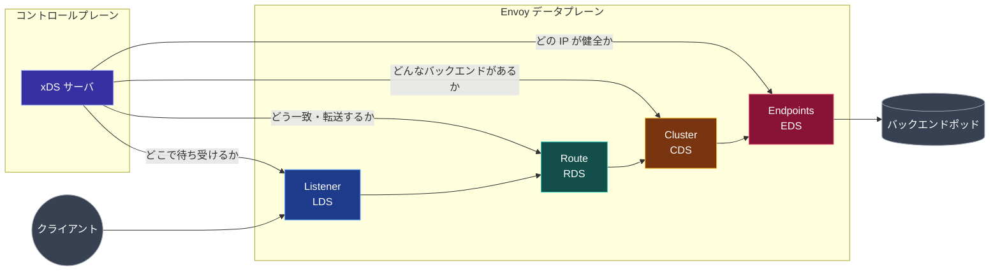

[English](README.md) | **日本語**


# envoy-xds-deep-dive

**Envoy の動的コンフィグ API** (LDS / RDS / CDS / EDS) を、上から下へ読み進め、手を動かしながら理解する深掘りリポジトリ。テーマは一つに絞ってある: **あるポッドから別のポッドへ Envoy サイドカー越しに通信させ、コントロールプレーンが各ホップをどう構成するかを観察する。**

xDS の予備知識は不要。各章は前の章の上に積み上がり、章ごとに対応するハンズオンがある。ラボは手元のノート PC で Docker と（最後だけ）`kind` のローカル Kubernetes で動く。

## 読み終えたらできるようになること

- LDS / RDS / CDS / EDS がそれぞれ何を配信するか、なぜ分割されているかを説明できる。
- Envoy の `config_dump` を読み、各 xDS API が生成したリソースを指し示せる。
- 本物の gRPC コントロールプレーン（`go-control-plane`）を動かし、Envoy の **ACK** / **NACK** をリアルタイムで観察できる。
- `kind` 上に 2 ポッドの「メッシュ」を立て、コントロールプレーンが両サイドカーを結線し、スケール時にエンドポイントをライブ更新する様子を見られる。

## 1 枚の図でつかむメンタルモデル

xDS は、**コントロールプレーン**が Envoy の**データプレーン**に「何をすべきか」を、 Envoy を再起動せずに伝える仕組み。4 つのコア API は、Envoy がリクエストをルーティングするために必要な 4 つの要素に 1 対 1 で対応する。



リクエストは **Listener** に入り、**Route** で **Cluster** に振り分けられ、一つの **Endpoint** へロードバランスされる。xDS はこの 4 つの箱を配送する仕組みにすぎない。

> **図の凡例（リポジトリ全体で一貫）:** 青 = Listener / LDS、ティール = Route / RDS、アンバー = Cluster / CDS、ローズ = Endpoints / EDS、インディゴ = コントロールプレーン、シアン = Envoy / データプレーン、グレー = 外部アクター。外部アクターは形でも区別する（円 = クライアント、円筒 = バックエンド）。色だけに依存しないためだ。

## 読む順番

章は順番に読む。各章の最後に、内容を具体化する「やってみる」ラボへのリンクがある。

| #   | 章                                                          | 学ぶこと                                                       | ラボ                                              |
| --- | ----------------------------------------------------------- | -------------------------------------------------------------- | ------------------------------------------------- |
| 00  | [前提知識](docs/00-prerequisites/README.ja.md)              | プロキシ、L4/L7、データ/コントロールプレーン、リクエストの一生 | n/a                                               |
| 01  | [Envoy 設定モデル](docs/01-envoy-config-model/README.ja.md) | listener / route / cluster / endpoint を静的 YAML で           | [Lab 00](labs/00-static-bootstrap/README.ja.md)   |
| 02  | [xDS 概観](docs/02-xds-overview/README.ja.md)               | ディスカバリサービス、ACK/NACK、ADS、順序                      | [Lab 01](labs/01-filesystem-xds/README.ja.md)     |
| 03  | [LDS](docs/03-lds/README.ja.md)                             | Listener Discovery Service                                     | [Lab 01](labs/01-filesystem-xds/README.ja.md)     |
| 04  | [RDS](docs/04-rds/README.ja.md)                             | Route Discovery Service                                        | [Lab 01](labs/01-filesystem-xds/README.ja.md)     |
| 05  | [CDS](docs/05-cds/README.ja.md)                             | Cluster Discovery Service                                      | [Lab 02](labs/02-grpc-control-plane/README.ja.md) |
| 06  | [EDS](docs/06-eds/README.ja.md)                             | Endpoint Discovery Service                                     | [Lab 02](labs/02-grpc-control-plane/README.ja.md) |
| 07  | [Pod-to-pod](docs/07-pod-to-pod/README.ja.md)               | サイドカー、inbound/outbound、ミニメッシュ                     | [Lab 03](labs/03-pod-to-pod-kind/README.ja.md)    |
| 99  | [用語集・参考文献](docs/99-glossary/README.ja.md)           | 用語とリンク                                                   | n/a                                               |

## ラボ: だんだんリアルになる

ラボごとにコントロールプレーンが本物に近づく。Envoy データプレーン側はほとんど変わらない。そこがポイント。

| ラボ                                          | コントロールプレーン | トランスポート   | 実行基盤             |
| --------------------------------------------- | -------------------- | ---------------- | -------------------- |
| [00](labs/00-static-bootstrap/README.ja.md)   | なし（静的ファイル） | n/a              | Docker Compose       |
| [01](labs/01-filesystem-xds/README.ja.md)     | テキストエディタ     | ファイルシステム | Docker Compose       |
| [02](labs/02-grpc-control-plane/README.ja.md) | `go-control-plane`   | gRPC ADS         | Docker Compose       |
| [03](labs/03-pod-to-pod-kind/README.ja.md)    | メッシュ制御プレーン | gRPC ADS         | `kind`（Kubernetes） |

## リポジトリ構成

```text
envoy-xds-deep-dive/
├── docs/                      # 散文。順番に読む
│   ├── 00-prerequisites/
│   ├── 01-envoy-config-model/
│   ├── 02-xds-overview/
│   ├── 03-lds/ … 06-eds/
│   ├── 07-pod-to-pod/
│   └── 99-glossary/
├── labs/                      # 実行可能・検証済みのハンズオン
│   ├── 00-static-bootstrap/
│   ├── 01-filesystem-xds/
│   ├── 02-grpc-control-plane/
│   └── 03-pod-to-pod-kind/
└── scripts/                   # 管理インターフェース用ヘルパー
```

## ラボ実行の前提ツール

- `docker` と `docker compose`
- `envoy`（任意。ローカルでの `--mode validate` 用）。ラボでは Envoy を Docker で動かす
- `go` 1.25 以降（コントロールプレーンのイメージを再ビルドする場合のみ。通常は Docker がビルドする）
- `kind` と `kubectl`（Lab 03 のみ）

まずは [00 前提知識](docs/00-prerequisites/README.ja.md) から。

## ライセンス

[MIT](LICENSE)。
