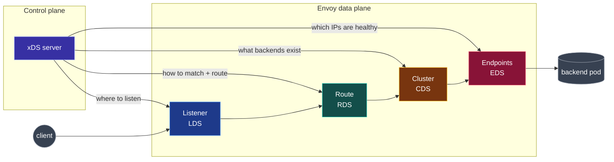

**English** | [日本語](README.ja.md)

# envoy-xds-deep-dive

A read-top-to-bottom, run-as-you-go deep dive into **Envoy's dynamic configuration APIs** (LDS, RDS, CDS, and EDS) built around a single concrete goal: **make one pod talk to another pod through Envoy sidecars, and watch the control plane program every hop.**

You do not need to know xDS already. Each chapter builds on the previous one, and each chapter has a matching hands-on lab you can run on your laptop with Docker and (for the finale) a local Kubernetes cluster via `kind`.

## What you will be able to do by the end

- Explain what LDS / RDS / CDS / EDS each discover, and why they are split apart.
- Read an Envoy `config_dump` and point at the resource each xDS API produced.
- Run a real gRPC control plane (`go-control-plane`) and watch Envoy **ACK** and **NACK** configuration in real time.
- Stand up a two-pod "mesh" on `kind` where a control plane wires both sidecars together and updates endpoints live as you scale.

## The mental model in one picture

xDS is how a **control plane** tells Envoy's **data plane** what to do, without restarting Envoy. The four core APIs map one-to-one onto the four things Envoy needs to route a request:



A request enters a **Listener**, is matched by a **Route** to a **Cluster**, and is load-balanced to one **Endpoint**. xDS is just the delivery mechanism for each of those four boxes.

> **Diagram legend (used consistently throughout this repo):** blue = Listener / LDS, teal = Route / RDS, amber = Cluster / CDS, rose = Endpoints / EDS, indigo = control plane, cyan = Envoy / data plane, gray = external actor. External actors also use distinct shapes (circle = client, cylinder = backend) so the diagrams never rely on color alone.

## Reading order

Read the chapters in order. Each ends with a "Try it" link to the lab that makes it concrete.

| #   | Chapter                                                    | You will learn                                             | Lab                                            |
| --- | ---------------------------------------------------------- | ---------------------------------------------------------- | ---------------------------------------------- |
| 00  | [Prerequisites](docs/00-prerequisites/README.md)           | proxy, L4/L7, data vs control plane, the request lifecycle | n/a                                            |
| 01  | [Envoy config model](docs/01-envoy-config-model/README.md) | listener / route / cluster / endpoint as static YAML       | [Lab 00](labs/00-static-bootstrap/README.md)   |
| 02  | [xDS overview](docs/02-xds-overview/README.md)             | discovery services, ACK/NACK, ADS, ordering                | [Lab 01](labs/01-filesystem-xds/README.md)     |
| 03  | [LDS](docs/03-lds/README.md)                               | Listener Discovery Service                                 | [Lab 01](labs/01-filesystem-xds/README.md)     |
| 04  | [RDS](docs/04-rds/README.md)                               | Route Discovery Service                                    | [Lab 01](labs/01-filesystem-xds/README.md)     |
| 05  | [CDS](docs/05-cds/README.md)                               | Cluster Discovery Service                                  | [Lab 02](labs/02-grpc-control-plane/README.md) |
| 06  | [EDS](docs/06-eds/README.md)                               | Endpoint Discovery Service                                 | [Lab 02](labs/02-grpc-control-plane/README.md) |
| 07  | [Pod-to-pod](docs/07-pod-to-pod/README.md)                 | sidecars, inbound/outbound, a mini mesh                    | [Lab 03](labs/03-pod-to-pod-kind/README.md)    |
| 99  | [Glossary & references](docs/99-glossary/README.md)        | terms and links                                            | n/a                                            |

## The labs, in increasing realism

The control plane gets more real with each lab. The Envoy data plane barely changes: that is the point.

| Lab                                        | Control plane      | Transport  | Runs on             |
| ------------------------------------------ | ------------------ | ---------- | ------------------- |
| [00](labs/00-static-bootstrap/README.md)   | none (static file) | n/a        | Docker Compose      |
| [01](labs/01-filesystem-xds/README.md)     | your text editor   | filesystem | Docker Compose      |
| [02](labs/02-grpc-control-plane/README.md) | `go-control-plane` | gRPC ADS   | Docker Compose      |
| [03](labs/03-pod-to-pod-kind/README.md)    | mesh control plane | gRPC ADS   | `kind` (Kubernetes) |

## Repository layout

```text
envoy-xds-deep-dive/
├── docs/                      # the prose, read in order
│   ├── 00-prerequisites/
│   ├── 01-envoy-config-model/
│   ├── 02-xds-overview/
│   ├── 03-lds/ … 06-eds/
│   ├── 07-pod-to-pod/
│   └── 99-glossary/
├── labs/                      # runnable, verified hands-on
│   ├── 00-static-bootstrap/
│   ├── 01-filesystem-xds/
│   ├── 02-grpc-control-plane/
│   └── 03-pod-to-pod-kind/
└── scripts/                   # admin-interface helpers
```

## Prerequisites to run the labs

- `docker` and `docker compose`
- `envoy` (optional, for local `--mode validate`); the labs run Envoy in Docker
- `go` 1.24+ (only to rebuild the control plane images; Docker builds them for you)
- `kind` and `kubectl` (Lab 03 only)

Start at [00 Prerequisites](docs/00-prerequisites/README.md).
