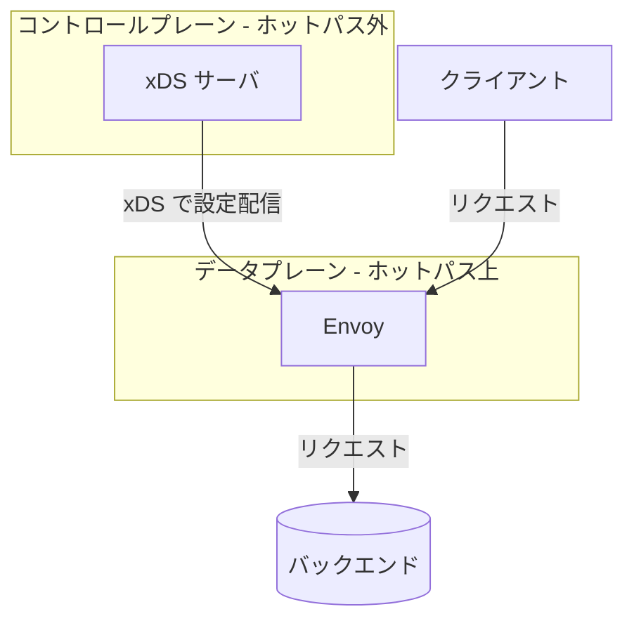
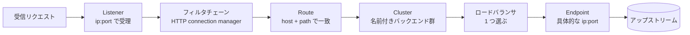

[English](README.md) | **日本語**

# 00 — 前提知識

この章では、リポジトリ全体が前提とする語彙をそろえる。リバースプロキシとは何か、
L4 と L7 の違い、「データプレーンとコントロールプレーン」の意味がすでに分かっていれば、
ざっと流して次へ進んでよい。そうでなければ丁寧に読む — 後続の章はすべてこの土台に乗る。

## プロキシとは

**プロキシ**は、接続の中間に立ち、別の何かの代理としてトラフィックを中継するサーバ。

- **フォワードプロキシ**は*クライアント*の前に立ち、その代理として広いインターネットと
  通信する（例: 社内の egress プロキシ）。
- **リバースプロキシ**は*サーバ*の前に立ち、その代理としてトラフィックを受ける
  （例: Web サーバ群の前段のロードバランサ）。

Envoy はほぼ常に**リバースプロキシ**として使われる。単一アプリの前に立つ「サイドカー」も
この一種。

## L4 と L7

これらはネットワークスタックの層を指し、*プロキシがトラフィックをどこまで理解するか*を
決める。

- **L4（トランスポート層）**: プロキシは TCP/UDP 接続 — IP、ポート、バイト列 — を見る。
  接続の転送や分散はできるが、HTTP のパスやヘッダは読めない。
- **L7（アプリケーション層）**: プロキシはアプリプロトコル（HTTP, gRPC）を解釈する。
  パス・ホスト・ヘッダでルーティングし、リトライし、ヘッダを注入し、リクエスト単位の
  メトリクスを取れる。

Envoy は両方をこなすが、面白い xDS ルーティング（RDS）は L7 の概念だ。Envoy が HTTP を
理解しているからこそ存在する。

## データプレーンとコントロールプレーン

これがリポジトリ全体で最も重要な区別。

- **データプレーン**は実際にバイトを動かすもの = Envoy。クライアントからバックエンドへ
  リクエストを転送する。すべてのリクエストの「ホットパス」上にいる。
- **コントロールプレーン**はデータプレーンを*設定する*もの。どんな listener / route /
  cluster / endpoint が存在すべきかを決め、Envoy に伝える。リクエストのホットパス上には
  **いない**。

xDS は、その下向き矢印の上で話されるプロトコル。このリポジトリはすべてこの矢印の話だ。

## なぜ xDS は gRPC と protobuf の上に作られているのか

gRPC の専門家である必要はないが、2 点だけ重要:

1. **protobuf** は Envoy の設定が定義されているスキーマ言語。「Listener」「Cluster」などは
   protobuf のメッセージ型。あなたが書く YAML は、それらメッセージの人間に優しいエンコーディング
   にすぎない。
2. **gRPC** は xDS に長命の双方向**ストリーム**を与える。設定が変わった瞬間にコントロール
   プレーンが*プッシュ*でき、Envoy は同じストリーム上で各プッシュを*確認応答（ACK）*できる。
   このストリーミング ACK/NACK ループこそ xDS の心臓部で、Lab 02 で直接観察する。

gRPC 版（Lab 02）に行く前に、まず xDS のもっと単純な配信を 2 つ見る — 静的 YAML（Lab 00）と
ディスク上のファイル（Lab 01）。*中身*は同一で、配信方法だけが変わる。

## Envoy を通るリクエストの一生

1 本の HTTP リクエストがたどる経路。先頭が大文字の 4 つの名詞を覚えること — それがそのまま
4 つの xDS API だ。

1. **Listener** が IP とポートで接続を受理する。
2. その中の**フィルタチェーン**（HTTP では *HTTP connection manager*）がリクエストを解析する。
3. **Route** がリクエストの host と path を一致させ、**Cluster** を選ぶ。
4. **Cluster** は名前付きのバックエンド群。そのロードバランサが転送先の **Endpoint**
   （具体的な IP とポート）を 1 つ選ぶ。

各名詞は、それぞれ専用の xDS API で配信される。

| 名詞 | xDS API | 正式名称 |
| --- | --- | --- |
| Listener | LDS | Listener Discovery Service |
| Route | RDS | Route Discovery Service |
| Cluster | CDS | Cluster Discovery Service |
| Endpoint | EDS | Endpoint Discovery Service |

## これから頻繁に出てくる用語

- **Bootstrap**: 起動時に Envoy がファイルから読む初期の静的設定。最低限、コントロール
  プレーンへの到達方法を Envoy に伝える。
- **管理インターフェース（admin）**: Envoy 組み込みの HTTP エンドポイント（既定 `:9901`）。
  `/config_dump`, `/clusters`, `/stats` などを公開する。Envoy が「今」何を信じているかを
  覗く主要な窓。
- **アップストリーム / ダウンストリーム**: *ダウンストリーム*はクライアント側、
  *アップストリーム*はバックエンド側。「cluster」は常にアップストリーム。
- **サイドカー**: 単一アプリインスタンスの隣（多くは同じ Kubernetes ポッド内）に配置され、
  そのアプリの inbound / outbound を代理する Envoy。

## やってみる

この章にラボはない — 純粋な語彙だ。[01 — Envoy 設定モデル](../01-envoy-config-model/README.ja.md)
へ進む。そこで 4 つの名詞を 1 つの静的 YAML として見て、実際に動かす。
