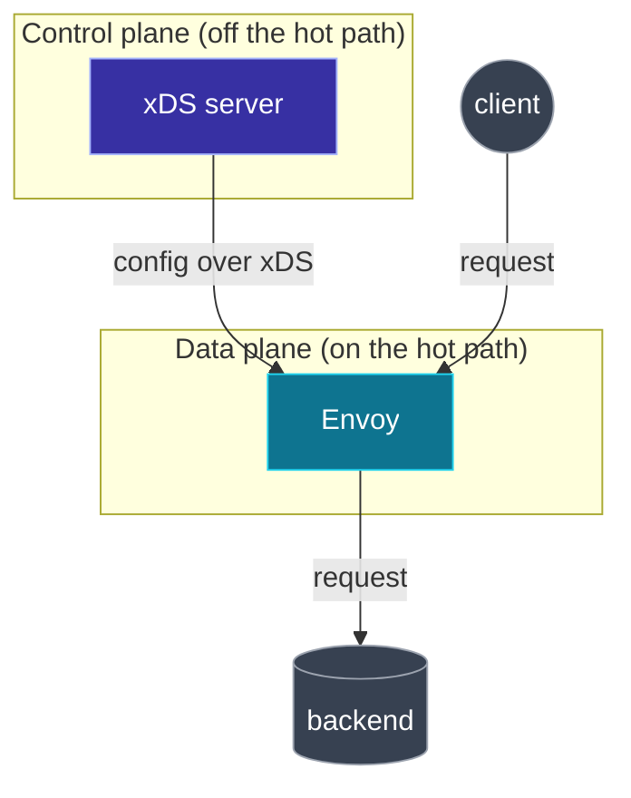

**English** | [日本語](README.ja.md)

# 00. Prerequisites

This chapter establishes the vocabulary the rest of the repo assumes. If you already know what a reverse proxy is, the difference between L4 and L7, and what "data plane vs control plane" means, skim this and move on. Otherwise, read it carefully: every later chapter leans on these ideas.

## What is a proxy

A **proxy** is a server that sits in the middle of a connection and relays traffic on behalf of something else.

- A **forward proxy** sits in front of *clients* and talks to the wider internet on their behalf (think: a corporate egress proxy).
- A **reverse proxy** sits in front of *servers* and accepts traffic on their behalf (think: a load balancer in front of your web servers).

Envoy is almost always used as a **reverse proxy**, including the "sidecar" case where it sits in front of a single application instance.

## L4 vs L7

These refer to layers of the networking stack, and they decide *how much the proxy understands about the traffic*.

- **L4 (transport)**: the proxy sees TCP/UDP connections: IPs, ports, bytes. It can forward and balance connections but cannot read HTTP paths or headers.
- **L7 (application)**: the proxy parses the application protocol (HTTP, gRPC). It can route on path, host, and headers, retry requests, inject headers, and collect per-request metrics.

Envoy does both, but the interesting xDS routing (RDS) is an L7 concept: it exists because Envoy understands HTTP.

## Data plane vs control plane

This is the single most important distinction in the whole repo.

- The **data plane** is the thing that actually moves your bytes: Envoy, forwarding requests from clients to backends. It is on the "hot path" of every request.
- The **control plane** is the thing that *configures* the data plane: it decides what listeners, routes, clusters, and endpoints should exist, and tells Envoy about them. It is **not** on the request hot path.

xDS is the protocol spoken on that downward arrow. Everything in this repo is about that arrow.

## Why xDS is built on gRPC and protobuf

You do not need to be a gRPC expert, but two facts matter:

1. **protobuf** is the schema language Envoy's configuration is defined in. A "Listener", a "Cluster", etc. are protobuf message types. The YAML you write is just a human-friendly encoding of those messages.
2. **gRPC** gives xDS a long-lived, bidirectional **stream**. The control plane can *push* new config the moment it changes, and Envoy can *acknowledge* each push on the same stream. This streaming ACK/NACK loop is the heart of xDS, and we will watch it directly in Lab 02.

You will also see xDS delivered two simpler ways first (as static YAML (Lab 00) and as files on disk (Lab 01)) before the gRPC version (Lab 02). The *content* is identical; only the delivery changes.

## The request lifecycle through Envoy

Here is the path a single HTTP request takes. Memorize the four capitalized nouns: they are exactly the four xDS APIs.

```mermaid
flowchart LR
    accTitle: The request lifecycle through Envoy
    accDescr: An incoming request passes through a Listener, a filter chain, a Route match, a Cluster, a load balancer, and one Endpoint before reaching the upstream.
    req((request)) --> lst[Listener<br/>accept on ip:port]
    lst --> fc[filter chain<br/>HTTP connection manager]
    fc --> rt[Route<br/>match host + path]
    rt --> cl[Cluster<br/>a named backend pool]
    cl --> lb[load balancer<br/>pick one]
    lb --> ep[Endpoint<br/>a concrete ip:port]
    ep --> up[(upstream)]
    class lst lds
    class rt rds
    class cl cds
    class ep eds
    class req,up ext
    classDef lds fill:#1e3a8a,stroke:#60a5fa,color:#fff
    classDef rds fill:#134e4a,stroke:#2dd4bf,color:#fff
    classDef cds fill:#78350f,stroke:#fbbf24,color:#fff
    classDef eds fill:#881337,stroke:#fb7185,color:#fff
    classDef ext fill:#374151,stroke:#9ca3af,color:#fff
```

1. A **Listener** accepts the connection on an IP and port.
2. Inside it, a **filter chain** (for HTTP, the *HTTP connection manager*) parses the request.
3. A **Route** matches the request's host and path and selects a **Cluster**.
4. The **Cluster** is a named pool of backends; its load balancer picks one **Endpoint** (a concrete IP and port) to forward to.

Each noun is discovered by its own xDS API:

| Noun | xDS API | Full name |
| --- | --- | --- |
| Listener | LDS | Listener Discovery Service |
| Route | RDS | Route Discovery Service |
| Cluster | CDS | Cluster Discovery Service |
| Endpoint | EDS | Endpoint Discovery Service |

## Key terms you will see constantly

- **Bootstrap**: the initial static config Envoy reads from a file at startup. At minimum it tells Envoy how to reach its control plane.
- **Admin interface**: Envoy's built-in HTTP endpoint (default `:9901`) exposing `/config_dump`, `/clusters`, `/stats`, etc. This is your primary window into what Envoy currently believes.
- **Upstream / downstream**: *downstream* is toward the client; *upstream* is toward the backend. A "cluster" is always an upstream.
- **Sidecar**: an Envoy deployed next to a single app instance (often in the same Kubernetes pod), proxying that app's inbound and/or outbound traffic.

## Try it

There is no lab for this chapter: it is pure vocabulary. Continue to [01 Envoy config model](../01-envoy-config-model/README.md), where you will see all four nouns as a single static YAML file and run it.
