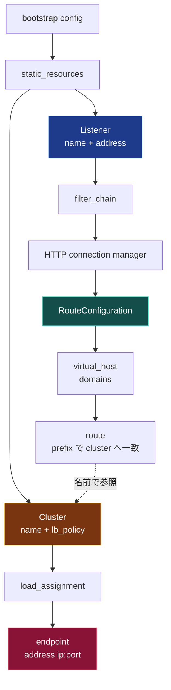

[English](README.md) | **日本語**

# 01 — Envoy の設定オブジェクトモデル

何かが「動的」になる前に、完全に**静的**な Envoy 設定を読み、章 00 の 4 つの名詞が
その中に座っているのを見られるようになろう。それができれば、xDS は神秘ではなくなる —
同じオブジェクトを、起動時ではなく後から配信しているだけだと分かる。

## オブジェクトの木構造

静的な Envoy 設定は `static_resources` ブロックを持つ 1 ファイル。中のオブジェクトは
こう入れ子になる。



xDS が後で分割するのはまさにこの 2 点なので、注目しておく。

1. **route** は **cluster を名前で**指す（`cluster: service_backend`）。listener と
   cluster は入れ子ではなく文字列でリンクされている。この緩い結合のおかげで、LDS と CDS
   を別ストリームにできる。
2. **cluster** はここではエンドポイントをインラインに持つ（`load_assignment`）。後で EDS が
   これを外出しし、cluster に触れずにエンドポイントを変えられるようにする。

## 静的設定を読む

[Lab 00](../../labs/00-static-bootstrap/envoy.yaml) は単一の `envoy.yaml`。形を削ると:

```yaml
static_resources:
  listeners:
    - name: listener_http              # 後で LDS が配信
      address: { socket_address: { address: 0.0.0.0, port_value: 10000 } }
      filter_chains:
        - filters:
            - name: envoy.filters.network.http_connection_manager
              typed_config:
                route_config:            # 後で RDS が配信
                  virtual_hosts:
                    - domains: ["*"]
                      routes:
                        - match: { prefix: "/" }
                          route: { cluster: service_backend }
  clusters:
    - name: service_backend            # 後で CDS が配信
      type: STRICT_DNS
      load_assignment:                 # 後で EDS が配信
        endpoints:
          - lb_endpoints:
              - endpoint:
                  address: { socket_address: { address: upstream, port_value: 5678 } }
```

各コメントは、後でディスカバリサービスが引き継ぐ場所を示す。Lab 00 の設定は「Before」の絵で、
残りのリポジトリが「After」だ。

## Envoy はどう報告し返すか

Envoy の管理インターフェースは、どの API が所有するかでグループ分けして同じオブジェクトを
返す。Lab 00 の `/config_dump` には次のダンプ種別が含まれる。

```text
BootstrapConfigDump      # Envoy に渡したファイル
ListenersConfigDump      # LDS が所有
RoutesConfigDump         # RDS が所有
ClustersConfigDump       # CDS が所有
... (EDS のエンドポイントは cluster 配下 / /clusters に出る)
```

Lab 00 が完全に静的でも、Envoy は内部状態をこの 4 つの API で整理している。これは「静的」と
「動的」が、別の入口を通った同じオブジェクトだという強いヒントだ。

## そもそもなぜオブジェクトを分割するのか

1 つの YAML で動くなら、なぜ xDS は 4 ストリームに割るのか。実システムでは、4 つの名詞は
変化する頻度がまったく異なり、所有者も別だからだ。

| 名詞 | 変わるとき | 典型的な頻度 |
| --- | --- | --- |
| Listener | ポートや TLS コンテキストを足すとき | まれ |
| Route | トラフィック分割やパスを変えるとき | ときどき |
| Cluster | サービスを足す/消すとき | ときどき |
| Endpoint | ポッドがスケール・再起動・ヘルスチェック失敗するとき | 絶えず |

ポッド 1 つの再起動のたびにモノリシックな設定を丸ごとプッシュするのは無駄でリスキー。
分割すれば、最も忙しいデータ（エンドポイント）を、他を乱さず単独で流せる。

## やってみる

[Lab 00 — 静的ブートストラップ](../../labs/00-static-bootstrap/README.ja.md) を実行する。
1 つの upstream の前に Envoy を 1 つ立て、リクエストを通し、`/config_dump` から 4 つの
オブジェクト種別を読み出す。戻ってきたら [02 — xDS 概観](../02-xds-overview/README.ja.md) へ。
ここからこれらのオブジェクトを動的に配信し始める。
