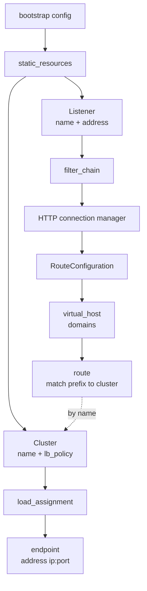

**English** | [日本語](README.ja.md)

# 01 — Envoy's config object model

Before anything is "dynamic", you should be able to read a fully **static**
Envoy config and see the four nouns from chapter 00 sitting in it. Once you can,
xDS stops being mysterious: it is just those same objects, delivered later
instead of at startup.

## The object tree

A static Envoy config is one file with a `static_resources` block. Inside it,
the objects nest like this:



Two things to notice, because they are exactly what xDS later splits apart:

1. The **route** points at a **cluster by name** (`cluster: service_backend`).
   The listener and the cluster are linked by a string, not by nesting. That
   loose coupling is why LDS and CDS can be separate streams.
2. The **cluster** contains its endpoints inline here (`load_assignment`). Later,
   EDS will pull that out so endpoints can change without touching the cluster.

## Reading the static config

[Lab 00](../../labs/00-static-bootstrap/envoy.yaml) is a single `envoy.yaml`.
The shape, trimmed:

```yaml
static_resources:
  listeners:
    - name: listener_http              # LDS will serve this later
      address: { socket_address: { address: 0.0.0.0, port_value: 10000 } }
      filter_chains:
        - filters:
            - name: envoy.filters.network.http_connection_manager
              typed_config:
                route_config:            # RDS will serve this later
                  virtual_hosts:
                    - domains: ["*"]
                      routes:
                        - match: { prefix: "/" }
                          route: { cluster: service_backend }
  clusters:
    - name: service_backend            # CDS will serve this later
      type: STRICT_DNS
      load_assignment:                 # EDS will serve this later
        endpoints:
          - lb_endpoints:
              - endpoint:
                  address: { socket_address: { address: upstream, port_value: 5678 } }
```

Every comment marks a place where a discovery service will later take over. The
config in Lab 00 is the "before" picture; the rest of the repo is the "after".

## How Envoy reports it back

Envoy's admin interface returns the same objects, grouped by which API owns them.
In Lab 00 the `/config_dump` contains these dump types:

```text
BootstrapConfigDump      # the file you gave Envoy
ListenersConfigDump      # owned by LDS
RoutesConfigDump         # owned by RDS
ClustersConfigDump       # owned by CDS
... (EDS endpoints show under the cluster / in /clusters)
```

Even though Lab 00 is fully static, Envoy *still* organizes its internal state
by these four APIs. That is a strong hint that "static" and "dynamic" are the
same objects through different doors.

## Why split the objects at all?

If one YAML file works, why does xDS break it into four streams? Because in a
real system the four nouns change at very different rates and are owned by
different parties:

| Noun | Changes when… | Typical rate |
| --- | --- | --- |
| Listener | you add a port or TLS context | rarely |
| Route | you change traffic splitting / paths | sometimes |
| Cluster | you add or remove a service | sometimes |
| Endpoint | a pod scales, restarts, or fails health checks | constantly |

Pushing a whole new monolithic config every time a single pod restarts would be
wasteful and risky. Splitting lets the busiest data (endpoints) flow on its own
without disturbing the rest.

## Try it

Run [Lab 00 — static bootstrap](../../labs/00-static-bootstrap/README.md): bring
up one Envoy in front of one upstream, send a request through it, and read the
four object types out of `/config_dump`. Then come back for
[02 — xDS overview](../02-xds-overview/README.md), where we start delivering
these objects dynamically.
