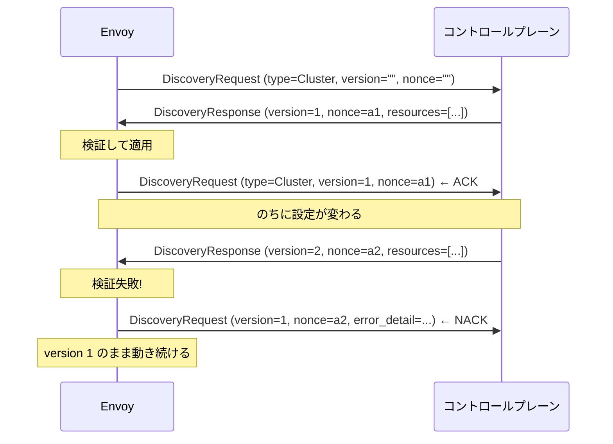
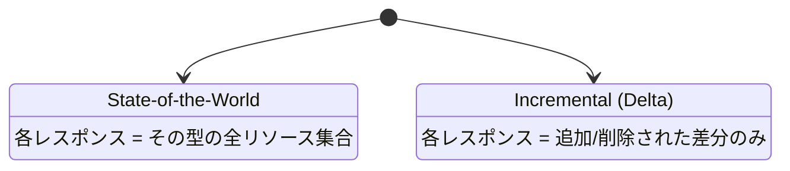
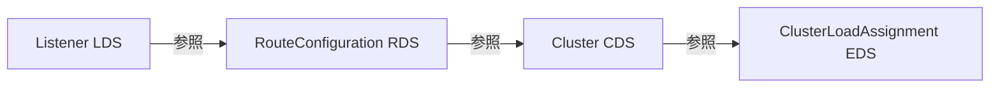

[English](README.md) | **日本語**

# 02 — xDS 概観

**xDS** = 「**x** Discovery Service」。**x** は Listener / Route / Cluster /
Endpoint / Secret などの総称。すべて同じプロトコルを共有し、運ぶリソース型だけが違う。
この章はそのプロトコルの話。章 03〜06 で各 API を個別に掘る。

## ファミリー

| API | リソース型 | 配信するもの |
| --- | --- | --- |
| LDS | Listener | Envoy がどこで待ち受けるか |
| RDS | RouteConfiguration | リクエストをどう一致・転送するか |
| CDS | Cluster | どんなアップストリーム群があるか |
| EDS | ClusterLoadAssignment | cluster を支えるエンドポイント IP |
| SDS | Secret | TLS 証明書と鍵 |
| ADS | (上記すべて) | 全型を 1 本の順序付きストリームで運ぶ |

このリポジトリは LDS / RDS / CDS / EDS に集中し、**ADS** でそれらを運ぶ。

## 同じリソースを配る 3 つの方法

リソースは、どう届こうと同一の protobuf メッセージ。ラボはこのはしごを意図的に登る。

1. **静的**（Lab 00）: bootstrap ファイルに焼き込む。ディスカバリは一切ない。
2. **ファイルシステム**（Lab 01）: Envoy がファイルパスを監視し、あなたがファイルを編集する。
   コントロールプレーンのコードなしで「何が」配られるかを理解するのに最適。
3. **gRPC**（Lab 02・03）: 本物のコントロールプレーンがリソースをストリームし、Envoy が
   ACK/NACK する。本番システム（Istio など）が使うやり方。

## トランスポート: request, response, ACK

gRPC 上で、Envoy とコントロールプレーンは長命ストリーム上で 2 種類のメッセージを交換する。

- **DiscoveryRequest** — Envoy が送る。「型 T のリソースが欲しい」（型によっては特定の名前も）。
  直前のレスポンスに対する ACK/NACK も兼ねる。
- **DiscoveryResponse** — コントロールプレーンが送る。「バージョン V 時点の型 T のリソースは
  これだ」。**nonce** が刻印される。

ループはこう動く。



これを成立させるのは 2 つのフィールド。

- **version_info**: Envoy が*正常に適用した*設定のバージョン。ACK では新バージョンをエコーする。
  NACK では**古い**バージョンをエコーし（動いていない）、`error_detail` を埋める。
- **nonce**: この request が*どのレスポンス*に答えているかを識別する。複数が飛行中でも
  コントロールプレーンが ACK とプッシュを対応付けられる。

### ACK と NACK を具体的に

[Lab 02](../../labs/02-grpc-control-plane/README.ja.md) ではコントロールプレーンが両方をログに出す。
健全なプッシュ:

```text
stream 1  SEND Listener version="1" (1 resources)
stream 1   ACK Listener version="1"
```

Envoy が拒否するプッシュ（わざと listener のポートを 70000 — 65535 超 — にした）:

```text
stream 1  NACK Listener version="2": ... PortValue: value must be <= 65535
```

決定的に重要な性質: NACK は**安全**だ。Envoy は不正なリソースを拒否し、直前の正常なものを
配り続ける。コントロールプレーンからの不正設定は、障害ではなく「変更なし」に縮退する。

## State-of-the-World と Delta

トランスポートには 2 つの方式がある。



- **State-of-the-World (SotW)** が元祖で既定。各 DiscoveryResponse はその型の*完全な*
  リストを含む。リストから cluster が消えていれば、それは削除を意味する。
- **Delta / Incremental** は変更分だけ送る。エンドポイントが数千あって 1 つだけ変わった、
  という場面でスケールする。

このリポジトリは SotW を使う（`go-control-plane` のスナップショットキャッシュの既定）。学習中は
そのほうが考えやすいからだ。メンタルモデル — バージョン、nonce、ACK/NACK — は両者で同じ。

## ADS と、なぜ順序が重要か

4 つのリソース型は独立していない。依存チェーンを成す。



Listener は route config を名前で指し、route は cluster を指し、cluster は EDS サービスを指す。
まだ学習していない cluster を指す Listener を Envoy が受け取れば、参照が宙に浮く。

Envoy の規則は **「make before break（壊す前に作る）」**。

- チェーンを*下る*（追加する）ときは、依存先を先に学ぶ: **CDS は EDS より先**、
  **LDS は RDS より先**。cluster は、それを満たすエンドポイントより先に存在すべき。
- チェーンを*上る*（削除する）ときは、参照する側を先に消す。

各型が別々の gRPC ストリームにあると、コントロールプレーンはこの順序をストリーム間で保証できない。
**ADS（Aggregated Discovery Service）**は全型を**1 本**のストリームに多重化して解決する。
そこではコントロールプレーンがレスポンスの順序を正確に制御できる。この順序は Lab 02 のログで
直接見える。

```text
SEND Cluster       version="1"      ← まず CDS
SEND ClusterLoadAssignment ...      ← 次に EDS
ACK  Cluster
SEND Listener      version="1"      ← LDS
ACK  ClusterLoadAssignment
SEND RouteConfiguration ...         ← 次に RDS
ACK  Listener
ACK  RouteConfiguration
```

これが、02 以降のラボがすべて ADS を使う理由だ。依存関係的に正しい決定論的な更新を得る、
唯一の方法だから。

## ノード ID の役割

各 Envoy は bootstrap で（そして全 DiscoveryRequest で）**ノード ID** で自分を名乗る。
コントロールプレーンはそれを使って、*この* Envoy にどの設定を渡すかを決める。Lab 02 では
ノードは 1 つ。Lab 03 ではコントロールプレーンが、ノード ID だけを根拠に `app-a-sidecar` と
`app-b-sidecar` へ**別々の**リソースを配る。

## やってみる

[Lab 01 — filesystem xDS](../../labs/01-filesystem-xds/README.ja.md) を実行して、4 つの
リソース型が動的に配信される様子を見る（まだ gRPC ではないので*リソース*に集中できる）。
そのあと章 [03 LDS](../03-lds/README.ja.md) 〜 [06 EDS](../06-eds/README.ja.md) で 1 つずつ扱う。
