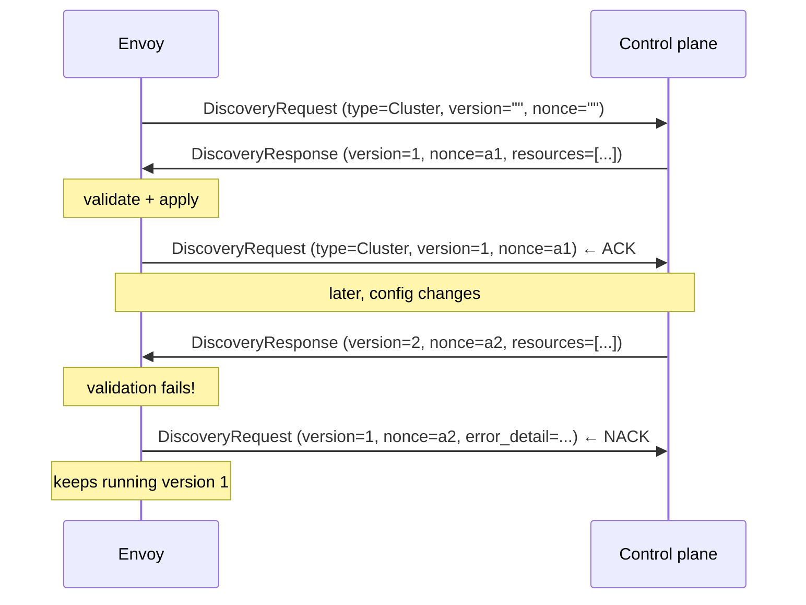
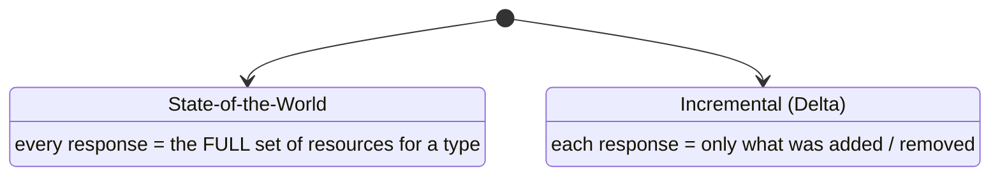
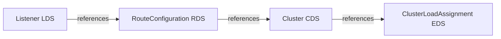

**English** | [日本語](README.ja.md)

# 02 — xDS overview

**xDS** = "**x** Discovery Service", where **x** stands in for Listener, Route,
Cluster, Endpoint, Secret, and a few more. They all share one protocol; only the
resource type they carry differs. This chapter is the protocol. Chapters 03–06
then zoom into each API.

## The family

| API | Resource type | Discovers |
| --- | --- | --- |
| LDS | Listener | where Envoy listens |
| RDS | RouteConfiguration | how requests are matched and routed |
| CDS | Cluster | what upstream pools exist |
| EDS | ClusterLoadAssignment | which endpoint IPs back a cluster |
| SDS | Secret | TLS certs and keys |
| ADS | (all of the above) | one ordered stream carrying every type |

This repo focuses on LDS / RDS / CDS / EDS, and uses **ADS** to carry them.

## Three ways to deliver the same resources

The resources are identical protobuf messages no matter how they arrive. The
labs walk up this ladder deliberately:

1. **Static** (Lab 00): baked into the bootstrap file. No discovery at all.
2. **Filesystem** (Lab 01): Envoy watches a file path; you edit the file. Great
   for understanding *what* is delivered without any control-plane code.
3. **gRPC** (Lab 02 and 03): a real control plane streams resources and Envoy
   ACK/NACKs them. This is what production systems (Istio, etc.) use.

## The transport: request, response, ACK

Over gRPC, Envoy and the control plane exchange two message types on a long-lived
stream:

- **DiscoveryRequest** — sent by Envoy. "I want resources of type T" (and, for
  some types, specific names). It also carries the ACK/NACK of the last response.
- **DiscoveryResponse** — sent by the control plane. "Here are the resources of
  type T at version V", stamped with a **nonce**.

The loop works like this:



Two fields make this work:

- **version_info**: which version of the config Envoy has *successfully applied*.
  On an ACK, Envoy echoes the new version. On a NACK, Envoy echoes the **old**
  version (it did not move) and fills in `error_detail`.
- **nonce**: identifies *which response* this request is answering, so the
  control plane can correlate ACKs to pushes even when several are in flight.

### ACK vs NACK, concretely

In [Lab 02](../../labs/02-grpc-control-plane/README.md) the control plane logs
both. A healthy push:

```text
stream 1  SEND Listener version="1" (1 resources)
stream 1   ACK Listener version="1"
```

A push Envoy rejects (we deliberately set a listener port of 70000, which is
greater than 65535):

```text
stream 1  NACK Listener version="2": ... PortValue: value must be <= 65535
```

The crucial property: a NACK is **safe**. Envoy rejects the bad resource and
keeps serving the last good one. Bad config from the control plane degrades to
"no change", not to an outage.

## State-of-the-World vs Delta

There are two variants of the transport:



- **State-of-the-World (SotW)** is the original and the default. Every
  DiscoveryResponse contains the *complete* list of resources for that type. If
  a cluster is missing from the list, it is deleted.
- **Delta / Incremental** sends only changes. It scales better when you have
  thousands of endpoints and only one changed.

This repo uses SotW (what `go-control-plane`'s snapshot cache serves by default),
because it is easier to reason about while learning. The mental model — versions,
nonces, ACK/NACK — is the same for both.

## ADS and why ordering matters

The four resource types are not independent. They form a dependency chain:



A Listener names a route config; a route names a cluster; a cluster names an EDS
service. If Envoy receives a Listener that points at a cluster it has not learned
yet, it has a dangling reference.

Envoy's rule is **"make before break"**:

- Going *down* the chain (adding), learn the dependency first: **CDS before EDS**,
  **LDS before RDS**. A cluster should exist before the endpoints that fill it.
- Going *up* the chain (removing), remove the referrer first.

If each type is on its own gRPC stream, the control plane cannot guarantee this
ordering across streams. **ADS (Aggregated Discovery Service)** solves it by
multiplexing all types onto **one** stream, where the control plane controls the
exact order of responses. You can see this ordering directly in the Lab 02 log:

```text
SEND Cluster       version="1"      ← CDS first
SEND ClusterLoadAssignment ...      ← then EDS
ACK  Cluster
SEND Listener      version="1"      ← LDS
ACK  ClusterLoadAssignment
SEND RouteConfiguration ...         ← then RDS
ACK  Listener
ACK  RouteConfiguration
```

This is why every lab from 02 onward uses ADS: it is the only way to get
deterministic, dependency-correct updates.

## Where node identity comes in

Each Envoy identifies itself with a **node id** in its bootstrap (and on every
DiscoveryRequest). The control plane uses it to decide *which* config this
particular Envoy should get. In Lab 02 there is one node; in Lab 03 the control
plane serves **different** resources to `app-a-sidecar` and `app-b-sidecar` based
purely on their node id.

## Try it

Run [Lab 01 — filesystem xDS](../../labs/01-filesystem-xds/README.md) to see all
four resource types delivered dynamically (no gRPC yet, so you can focus on the
*resources*). Then chapters [03 LDS](../03-lds/README.md) through
[06 EDS](../06-eds/README.md) take each one in turn.
