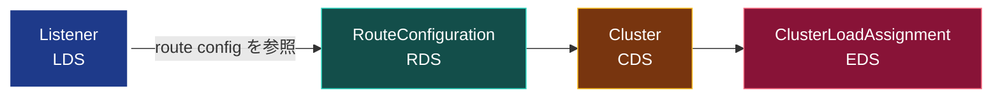

[English](README.md) | **日本語**

# 03 — LDS (Listener Discovery Service)

LDS は **Listener** を配信する。Envoy が開くソケットと、そこへ届くトラフィックを処理する
フィルタチェーンだ。データパスの*入口*なので、依存チェーンの最上段に座る。



## Listener が持つもの

- **address**: バインドする IP とポート（例 `0.0.0.0:10000`）。
- **filter_chains**: ネットワークフィルタのチェーン（複数可）。HTTP では鍵となるのが
  **HTTP connection manager (HCM)** で、ルーティングを所有する。
- 任意: TLS コンテキスト、フィルタチェーンの一致（SNI や送信元 IP による）など。

HCM はルートを次の 2 通りで得る。

1. **インライン**（`route_config:`）— ルートが listener の一部。
2. **RDS 経由**（`rds:`）— listener は route config を名前で指すだけ。RDS が配信する。

`rds` を選ぶことで LDS → RDS の分割が現実になる。listener は「自分のルートは `local_route`
という名前だ。別途取ってこい」と言う。

```yaml
- "@type": type.googleapis.com/envoy.config.listener.v3.Listener
  name: listener_http
  address:
    socket_address: { address: 0.0.0.0, port_value: 10000 }
  filter_chains:
    - filters:
        - name: envoy.filters.network.http_connection_manager
          typed_config:
            "@type": type.googleapis.com/...HttpConnectionManager
            stat_prefix: ingress_http
            rds:                         # <- LDS から RDS へ引き継ぐ
              route_config_name: local_route
              config_source: { ads: {} }
            http_filters:
              - name: envoy.filters.http.router
                typed_config: { "@type": type.googleapis.com/...Router }
```

## 依存ルール

listener は route config（ひいては cluster）を参照する。「make before break」では:

- listener が必要とする route config と cluster は、それを参照する listener より**先**に
  届くべき。さもないと Envoy は空のルートテーブルで listener をウォームしてしまう。
- ADS はこれを、CDS/EDS を先に、次に LDS、最後に RDS という順で送って強制する。Envoy は
  route config が届くまで listener を「ウォーム中（まだ配信しない）」に保てる。

## 確認する

管理インターフェースで:

```bash
# 今 Envoy が持つ listener とバインドアドレスだけ
curl -s localhost:9901/config_dump?resource=dynamic_listeners | \
  grep -E 'name|port_value'

# あるいは人間向けサマリ
curl -s localhost:9901/listeners
```

動的配信された listener はダンプの `dynamic_listeners` 配下に出る（静的なら
`static_listeners`）。各々が最後に更新された `version_info` を持つ — その番号が章 02 で見た
ACK だ。

## 落とし穴

- **listener のドレイン**: listener の差し替えはタダではない。Envoy は古い方を穏当にドレイン
  するので、本来 RDS や EDS に属する変更で listener を再プッシュしたくはない。
- **HCM には `stat_prefix` が必須**。無いと Envoy は NACK する。
- **不正な listener 1 つが他を巻き込まない**: LDS は SotW だが、不正な Listener リソースが
  1 つあると Envoy は*その更新*を拒否し、直前の正常な集合を保つ。

## やってみる

[Lab 01](../../labs/01-filesystem-xds/README.ja.md) はまさにこの listener をファイルシステム
経由で配る。`xds/lds.yaml` を開いて `port_value` を変え、リロードを発火させ、`/config_dump`
が新しいバインドポートを拾うのを見る。次は [04 — RDS](../04-rds/README.ja.md)。
