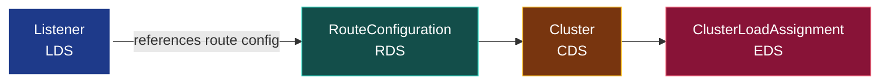

**English** | [日本語](README.ja.md)

# 03. LDS (Listener Discovery Service)

LDS discovers **Listeners**: the sockets Envoy opens and the filter chains that process traffic arriving on them. It is the *entry point* of the data path, so it sits at the top of the dependency chain.



## What a Listener contains

- **address**: the IP and port to bind (e.g. `0.0.0.0:10000`).
- **filter_chains**: one or more chains of network filters. For HTTP, the key filter is the **HTTP connection manager (HCM)**, which owns the routing.
- Optional: TLS contexts, filter-chain matching (by SNI, source IP), and so on.

The HCM gets its routes one of two ways:

1. **inline** (`route_config:`): the routes are part of the listener.
2. **via RDS** (`rds:`): the listener only names a route config; RDS delivers it.

Choosing `rds` is what makes the LDS → RDS split real. The listener says "my routes are called `local_route`, fetch them separately":

```yaml
- "@type": type.googleapis.com/envoy.config.listener.v3.Listener
  name: listener_http
  address:
    socket_address: { address: 0.0.0.0, port_value: 10000 }
  filter_chains:
    - filters:
        - name: envoy.filters.network.http_connection_manager
          typed_config:
            "@type": type.googleapis.com/...HttpConnectionManager
            stat_prefix: ingress_http
            rds:                         # <- LDS hands off to RDS
              route_config_name: local_route
              config_source: { ads: {} }
            http_filters:
              - name: envoy.filters.http.router
                typed_config: { "@type": type.googleapis.com/...Router }
```

## The HTTP filter chain (where auth, rate limits, etc. live)

Our examples show a single HTTP filter, `router` (the one that actually performs
the route lookup and forwards upstream). But `http_filters` is an **ordered
list**, and every request passes through it top to bottom *before* routing
happens. This is where cross-cutting concerns live:

```yaml
http_filters:
  - name: envoy.filters.http.cors          # CORS handling
  - name: envoy.filters.http.jwt_authn     # verify a JWT
  - name: envoy.filters.http.ext_authz     # call an external authorizer
  - name: envoy.filters.http.ratelimit     # rate limiting
  - name: envoy.filters.http.router        # MUST be last: terminal filter
```

Two rules to remember:

- **`router` is terminal and must be last.** Filters before it can inspect,
  mutate, delay, or reject the request (e.g. `ext_authz` returning 403 stops the
  request before it ever reaches a cluster). The router ends the chain by
  dispatching upstream.
- **The filter chain is owned by the listener (LDS), not by routes (RDS).** So
  "turn on auth for this listener" is an LDS change; "send `/admin` to a different
  backend" is an RDS change. Per-route tweaks to a filter are possible via
  `typed_per_filter_config` on the route, but the *set* of filters is a listener
  concern.

This is the answer to where authn / authz / rate-limiting happens: not in the
route or the cluster, but in the HTTP filter chain that the listener carries.

## Dependency rules

A listener references a route config (and ultimately clusters). Under "make before break":

- The route config and clusters a listener needs should arrive **before** the listener that references them: otherwise Envoy warms the listener with an empty route table.
- ADS enforces this by sending CDS/EDS first, then LDS, then RDS. Envoy can "warm" a listener (hold it not-yet-serving) until its route config arrives.

## Inspecting it

With the admin interface:

```bash
# Just the listeners Envoy currently has, with their bound addresses
curl -s localhost:9901/config_dump?resource=dynamic_listeners | \
  grep -E 'name|port_value'

# Or the human-friendly summary
curl -s localhost:9901/listeners
```

A dynamically-delivered listener shows up under `dynamic_listeners` in the dump (a static one shows under `static_listeners`). Each carries the `version_info` it was last updated to: that number is the ACK you saw in chapter 02.

## Gotchas

- **Listener draining**: replacing a listener is not free. Envoy drains the old one gracefully, which is why you do not want to re-push listeners for changes that really belong to RDS or EDS.
- **`stat_prefix` is required** on the HCM; without it Envoy NACKs.
- **One bad listener does not take down the others**: LDS is SotW, but a single invalid Listener resource causes Envoy to reject *that update*, keeping the previous good set.

## Try it

[Lab 01](../../labs/01-filesystem-xds/README.md) delivers this exact listener via the filesystem. Open `xds/lds.yaml`, change the `port_value`, trigger a reload, and watch `/config_dump` pick up the new bound port. Next: [04 RDS](../04-rds/README.md).
