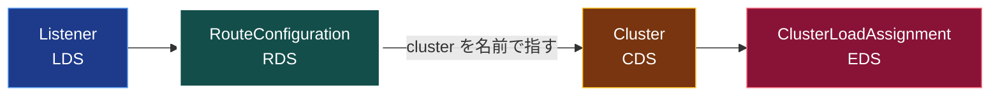
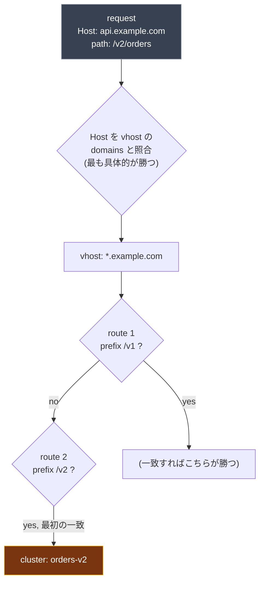

[English](README.md) | **日本語**

# 04. RDS (Route Discovery Service)

RDS は **RouteConfiguration** を配信する。届いた HTTP リクエストを（host と path で）一致させ、どの cluster へ送るかを決める規則だ。LDS と CDS の間に座る。

**Cluster** が交換可能な endpoint を*束ねる*のに対し、**route** はその逆で**分類器**だ。リクエストの属性（host, path, ヘッダ）で cluster を決定的に選ぶので、同じリクエストは必ず同じ cluster に着く。チェーン上の 2 つの「選択」は鏡像になっている。

- **route -> cluster**: *違うもの*の中から*正しい 1 つ*を一致で選ぶ。決定的。
- **cluster -> endpoint**: *交換可能なもの*の中から*どれか 1 つ*を LB で選ぶ。非決定的。

（例外は `weighted_clusters`。同じサービスの代替バリアント間を、カナリアのために重みで意図的に分配する。）



## RouteConfiguration が持つもの

- **name**。listener が要求したのと同じ名前（`route_config_name`）。
- **virtual_hosts** のリスト。各々が `domains`（Host ヘッダ）の集合に一致する。
- 各 vhost の中に **routes** のリスト。各 route は `match`（path prefix, 正規表現, ヘッダ）と `action`（通常 `route: { cluster: ... }`）を持つ。

```yaml
- "@type": type.googleapis.com/envoy.config.route.v3.RouteConfiguration
  name: local_route                  # <- listener の route_config_name と一致
  virtual_hosts:
    - name: backend
      domains: ["*"]
      routes:
        - match: { prefix: "/" }
          route: { cluster: service_backend }   # <- CDS の cluster を名前で指す
```

## リクエストがどう route を見つけるか（一致の順序）

route の選択は**2 段階**の一致で、順序が効く。

1. **`:authority`（Host ヘッダ）で virtual host を選ぶ。** Envoy は Host を各 vhost
   の `domains` と照合し、最も具体的なものを選ぶ。優先順位は: 完全一致
   （`api.example.com`）> 後方ワイルドカード（`*.example.com`）> 前方ワイルドカード
   （`api.*`）> キャッチオール（`*`）。勝つ vhost はちょうど 1 つ。
2. **その vhost 内で `routes` を上から順に評価し、最初に一致したものが勝つ。** route の
   一致は「最も具体的」ではなく順序依存。だから広い `prefix: "/"` を先頭に置くと、
   それ以降を全部覆い隠す。



ここから出てくる実務ルール:

- **具体的な route を先に、キャッチオール（`prefix: "/"`）は最後に**。さもないと
  キャッチオールが全部食う。
- どの vhost にも Host が一致しなければ 404。vhost には一致したが中の route に
  一致しなければ、それも 404。
- `match` は path 以外も見られる: `headers`、`query_parameters`、メソッド
  （`:method`）。「最初の一致が勝つ」ので、優先順位を明示的に書ける。

## なぜ RDS は LDS から分かれているのか

ルーティングは、*L7 的な理由で*最も頻繁に変わる設定だ。バージョン間のトラフィック移行、カナリアの重み、パス追加、タイムアウト変更。RDS を LDS から分けると、**listener に触れずに** ルーティングを作り変えられる。ソケットの入れ替えも接続ドレインもない。listener は上がったまま、ルートテーブルだけが差し替わる。

これがプログレッシブデリバリの背骨だ。重み付きルートは単なるデータにすぎない。

```yaml
routes:
  - match: { prefix: "/" }
    route:
      weighted_clusters:
        clusters:
          - { name: service_v1, weight: 90 }
          - { name: service_v2, weight: 10 }
```

これを RDS でプッシュすれば、listener を変えずに 10% のトラフィックが即座に v2 へ移る。

## 依存ルール

- route は cluster を名前で指す。その cluster は、route が参照する**前**に存在すべき（CDS）。さもないとそのルートに一致するリクエストは 503「no healthy upstream / cluster not found」になる。
- RDS は ADS ストリーム上で CDS/EDS の後、かつ LDS の後（または同時）に配信される。

## 確認する

```bash
# 動的 route config と、それが指す cluster
curl -s localhost:9901/config_dump?resource=dynamic_route_configs | \
  grep -E 'name|cluster'
```

異なる path や Host ヘッダでリクエストを送り、どのアップストリームが応答するかを見れば、ルーティング判断をライブで観察できる。

## 落とし穴

- 1 つの route config 内で **`domains` は一意**でなければならない。重複は NACK。
- **存在しない cluster** を指す route は RDS には受理されるが、リクエスト時に失敗する（503）。 RDS はプッシュ時に cluster の存在を検証しない。
- route config 名の不一致はよくあるバグ。listener が `local_route` を要求しているのに `local-route` を配ると、Envoy はルートを得られず、全リクエストが 404 になる。

## やってみる

[Lab 01](../../labs/01-filesystem-xds/README.ja.md) で `xds/rds.yaml` を編集して 2 つ目の route を足し（例: `prefix: /healthz` を別 cluster へ）、リロードし、listener が一度も再起動せずに新しいルーティングが効くのを確かめる。次は [05 CDS](../05-cds/README.ja.md)。
