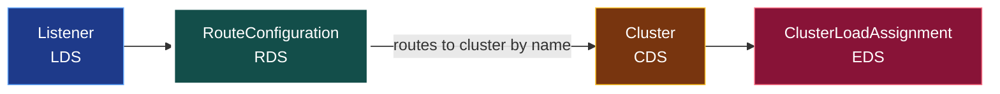
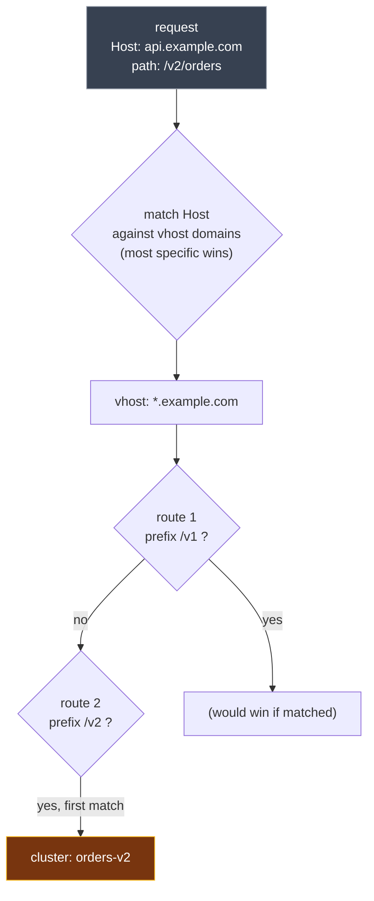

**English** | [日本語](README.ja.md)

# 04. RDS (Route Discovery Service)

RDS discovers **RouteConfigurations**: the rules that match an incoming HTTP request (by host and path) and decide which cluster it goes to. It sits between LDS and CDS.

Where a **Cluster** *bundles* interchangeable endpoints, a **route** is the opposite kind of thing: a **classifier**. It selects a cluster by the request's attributes (host, path, headers), deterministically, so the same request always lands on the same cluster. The two selections in the chain are mirror images:

- **route -> cluster**: pick the *correct* one among *different* things, by matching. Deterministic.
- **cluster -> endpoint**: pick *any* one among *interchangeable* things, by load balancing. Non-deterministic.

(The exception is `weighted_clusters`, which deliberately splits one route across substitutable variants of the same service by weight, for canary rollouts.)



## What a RouteConfiguration contains

- a **name**: the same name the listener asked for (`route_config_name`).
- a list of **virtual_hosts**, each matching a set of `domains` (Host headers).
- inside each vhost, a list of **routes**, each with a `match` (path prefix, regex, headers) and an `action` (usually `route: { cluster: ... }`).

```yaml
- "@type": type.googleapis.com/envoy.config.route.v3.RouteConfiguration
  name: local_route                  # <- matches the listener's route_config_name
  virtual_hosts:
    - name: backend
      domains: ["*"]
      routes:
        - match: { prefix: "/" }
          route: { cluster: service_backend }   # <- names a CDS cluster
```

## How a request finds its route (matching order)

Picking a route is a **two-level** match, and the order matters:

1. **Choose the virtual host by `:authority` (the Host header).** Envoy compares
   the host against every vhost's `domains` and picks the most specific match, in
   this priority: exact (`api.example.com`) > suffix wildcard (`*.example.com`) >
   prefix wildcard (`api.*`) > catch-all (`*`). Exactly one vhost wins.
2. **Within that vhost, evaluate `routes` top to bottom; the first match wins.**
   Route matching is ordered, not "most specific", so a broad `prefix: "/"`
   placed first will shadow everything below it.



The practical rules that fall out of this:

- Put **specific routes first, catch-all (`prefix: "/"`) last**, or the catch-all
  eats everything.
- A request whose Host matches no vhost gets a 404; a Host that matches a vhost
  but no route inside it also 404s.
- `match` can key on more than path: `headers`, `query_parameters`, method
  (`:method`), so "first match wins" lets you express priority explicitly.

## Why RDS is split from LDS

Routing is the part of config that changes most often *for L7 reasons*: shifting traffic between versions, canary weights, adding a path, changing a timeout. Splitting RDS from LDS means you can reshape routing **without touching the listener**: no socket churn, no connection draining. The listener stays up; only its route table is swapped.

This is the backbone of progressive delivery. A weighted route is just data:

```yaml
routes:
  - match: { prefix: "/" }
    route:
      weighted_clusters:
        clusters:
          - { name: service_v1, weight: 90 }
          - { name: service_v2, weight: 10 }
```

Push that via RDS and 10% of traffic shifts to v2 instantly, with no listener change.

## Dependency rules

- A route names clusters. Those clusters should exist (CDS) **before** the route references them, or requests matching that route get a 503 "no healthy upstream" / "cluster not found".
- RDS is delivered after CDS/EDS and after (or with) LDS on the ADS stream.

## Inspecting it

```bash
# Dynamic route configs and the clusters they target
curl -s localhost:9901/config_dump?resource=dynamic_route_configs | \
  grep -E 'name|cluster'
```

You can also see routing decisions live by sending requests with different paths and Host headers and watching which upstream answers.

## Gotchas

- **`domains` must be unique** across virtual hosts in one route config; an overlap is a NACK.
- A route that names a **nonexistent cluster** is accepted by RDS but fails at request time (503). RDS does not validate cluster existence at push time.
- Route config name mismatch is a common bug: if the listener asks for `local_route` but you serve `local-route`, Envoy never gets routes and every request 404s.

## Try it

In [Lab 01](../../labs/01-filesystem-xds/README.md), edit `xds/rds.yaml` to add a second route (e.g. match `prefix: /healthz` to a different cluster), reload, and confirm the new routing without the listener ever restarting. Next: [05 CDS](../05-cds/README.md).
