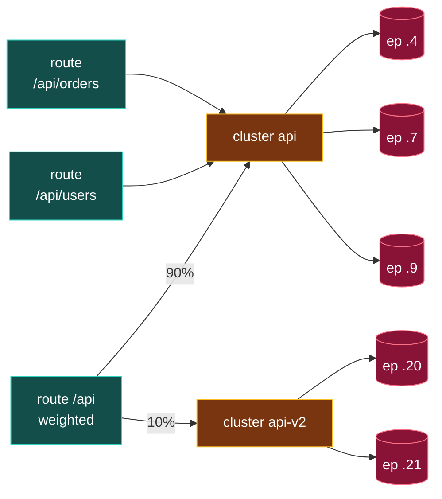

[English](README.md) | **日本語**

# 05. CDS (Cluster Discovery Service)

CDS は **Cluster** を配信する。**Cluster** は、**互いに交換可能な**アップストリーム endpoint（同じサービスのインスタンスで、どれに送っても同じ結果になるもの）を 1 つの名前で論理的に束ねたものだ。この交換可能性こそが要で、Envoy がそれらをロードバランスできる根拠になる。`api` の pod が交換可能でなければ、ランダムに 1 つ選ぶこと自体が壊れる。cluster はさらに、その束への*話し方*（ロードバランス方針、タイムアウト、ヘルスチェック、TLS、サーキットブレーカ）も定義する。ただし*どの*具体的なホストが束を満たすかは EDS に委ねる。

> **粒度の話。** 「同じ目的」とは*交換可能*という意味。サービス内をさらに区別したいとき（v1 だけ、1 ゾーンだけ）は、別 cluster に切る（下の基数図の `api-v1` / `api-v2`）か、**subset ロードバランシング**（1 つの cluster を endpoint のメタデータでサブグループ化し、route 側で選ぶ）を使う。どちらも*交換可能な endpoint をどの粒度で束ねるか*の選択にすぎない。


## cluster はどうエンドポイントを見つけるか

cluster の `type` フィールドが、エンドポイントの出どころを決める。

| type                         | エンドポイントの出どころ                    | 使う場所                       |
| ---------------------------- | ------------------------------------------- | ------------------------------ |
| `STATIC`                     | インラインの `load_assignment`（直書き IP） | Lab 00, Lab 03（ループバック） |
| `STRICT_DNS` / `LOGICAL_DNS` | ホスト名の DNS 解決                         | Lab 00 の upstream             |
| `EDS`                        | EDS API                                     | Lab 01, 02, 03                 |

面白いのは EDS 形式だ。cluster は「自分の中にエンドポイントを探すな。X という名前の load assignment を EDS に聞け」と言う。

```yaml
- "@type": type.googleapis.com/envoy.config.cluster.v3.Cluster
  name: service_backend
  type: EDS                          # <- エンドポイントは EDS から
  connect_timeout: 1s
  lb_policy: ROUND_ROBIN
  eds_cluster_config:
    service_name: service_backend    # <- 取得する EDS リソース名
    eds_config: { ads: {} }          # <- ADS ストリーム経由で
```

## cluster に載るその他のもの

単一ポッドがスケールしても変わるべきでない、バックエンドへの*接続*に関するすべて。

- **lb_policy**: `ROUND_ROBIN`, `LEAST_REQUEST`, `RING_HASH` など。
- **connect_timeout**, **health_checks**, **outlier_detection**。
- **circuit_breakers**: 最大接続数 / リクエスト数 / リトライ数。
- **transport_socket**: アップストリーム TLS（多くは SDS 経由）。

これが CDS を EDS から分ける理由だ。バックエンドの*ポリシー*は安定で、その*構成メンバ*は絶えず入れ替わる。ポリシーはまれに（CDS）、メンバは絶えず（EDS）プッシュする。

## 1 本の HTTP リクエストで見る

実際のリクエストが来たとき、cluster がどこで効くかを追う。

```bash
curl https://shop.example.com/api/orders/42
```

```text
1. Listener :443 が接続を受理 (TLS終端)
2. HCM が HTTP を解析: :authority shop.example.com, :path /api/orders/42
3. Route が host + prefix "/api" に一致  ->  cluster "api" へ
4. Cluster "api" が実作業(下記)をして転送
5. Endpoint 10.0.1.7:8080 が GET /api/orders/42 を受け取る
```

1〜3 は *cluster を名前で選ぶ*だけ。4 がすべて cluster の仕事で、この 1 リクエストに対して順に:

1. **健全性でふるい分け**: `api` の endpoint のうち `10.0.2.9`（ヘルスチェック失敗中）を除外。健全なのは `.4`, `.7`。
2. **ロードバランス**: `ROUND_ROBIN` が `10.0.1.7:8080` を選ぶ。
3. **サーキットブレーカ**: `api` は `max_requests` 未満か。超えていればここで 503。
4. **コネクションプール**: `.7` への既存接続を再利用、無ければ `connect_timeout` 以内に新規（アップストリーム mTLS）。
5. **転送**: その接続で `GET /api/orders/42` を送る。

つまり cluster は **宛先 1 つ分の実行単位**。「`api` へ送れ」を「この健全な pod・この接続・この上限で」に変換する。admin から同じ出来事が cluster 視点で見える（下の IP と数値は説明用。`cluster::ip:port::stat` のキー形式は Envoy が実際に出すものと同一で、Lab 02 で確認できる）。

```text
api::10.0.1.7:8080::health_flags::healthy
api::10.0.1.7:8080::rq_total::37            # この endpoint が捌いた数
api::10.0.2.9:8080::health_flags::/failed_active_hc   # 除外されたメンバ
api::default_priority::max_requests::1024   # サーキットブレーカ閾値
```

## route・cluster・endpoint の関係（基数）

どれも 1 対 1 ではない。

| 関係                | 基数                   | なぜ                                                   |
| ------------------- | ---------------------- | ------------------------------------------------------ |
| cluster -> endpoint | 1 : N                  | cluster はプール、endpoint はそのメンバ                |
| route -> cluster    | 通常 1 / weighted で N | route は cluster を 1 つ指す、または重みで複数に分ける |
| cluster -> route    | 1 : N                  | 複数の route が同じ cluster を指せる                   |



読み方: 多数の **route が 1 つの cluster に収束**し、cluster は多数の **endpoint にファンアウト**する。1 つの route が複数 cluster に分かれるのは重み付け（カナリア）のときだけ。形がどうあれ、1 リクエストの行き先は最終的に **endpoint 1 つ**。この非対称さが、層が独立して変えられる理由でもある。route を作り変えても cluster/endpoint は無傷、pod がスケールしても route は無傷。

## 依存ルール

- CDS は ADS ストリームで**最初**に送られる。cluster は、それを指す route より先に、それを満たすエンドポイントより先に存在しなければならない。
- まだエンドポイントのない `type: EDS` の cluster は妥当。ホスト数 0 で、EDS が供給するまで 503 を返すだけ。
- `connect_timeout` は**必須**で正の値でなければならない。`0` は NACK。

## 確認する

```bash
# cluster 名 + ディスカバリ type + lb ポリシー
curl -s localhost:9901/config_dump?resource=dynamic_active_clusters | \
  grep -E 'name|type|lb_policy'

# 実行時ビュー: cluster と現在のエンドポイント + 健全性
curl -s localhost:9901/clusters | grep service_backend
```

## 落とし穴

- **`type: EDS` なのに `eds_cluster_config` が無い** → NACK。EDS を求めるなら、どの service name とどの config source かを言わねばならない。
- **bootstrap の xDS cluster は HTTP/2 を話す必要がある。** gRPC コントロールプレーンを指す静的 cluster には `http2_protocol_options` が要る（Lab 02 の bootstrap 参照）。gRPC は HTTP/2 だ。これを忘れるのは典型的な「コントロールプレーンに到達できない」バグ。
- **cluster ウォーミング**: 新しい EDS cluster が追加されると、Envoy は使う前にそれを「ウォーム」する（エンドポイント取得、ヘルスチェック実行）。そのため、存在するがまだ配信していない短い窓がある。

## やってみる

[Lab 02](../../labs/02-grpc-control-plane/README.ja.md) はこの cluster を gRPC ADS で配る。コントロールプレーンのログを見る: まず `SEND Cluster version="1"` が来て、次に `ACK Cluster`。次は [06 EDS](../06-eds/README.ja.md)。
