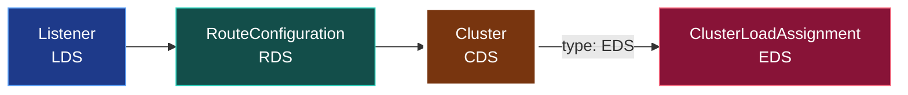

[English](README.md) | **日本語**

# 05. CDS (Cluster Discovery Service)

CDS は **Cluster** を配信する。Envoy がルーティングできる、名前付きのアップストリームホスト群だ。 cluster はバックエンドが*何*で*どう*話すか（ロードバランス方針、タイムアウト、ヘルスチェック、 TLS、サーキットブレーカ）を定義する。が、決定的に、*どの*ホストがそれを支えるかは EDS に委ねられる。



## cluster はどうエンドポイントを見つけるか

cluster の `type` フィールドが、エンドポイントの出どころを決める。

| type | エンドポイントの出どころ | 使う場所 |
| --- | --- | --- |
| `STATIC` | インラインの `load_assignment`（直書き IP） | Lab 00, Lab 03（ループバック） |
| `STRICT_DNS` / `LOGICAL_DNS` | ホスト名の DNS 解決 | Lab 00 の upstream |
| `EDS` | EDS API | Lab 01, 02, 03 |

面白いのは EDS 形式だ。cluster は「自分の中にエンドポイントを探すな。X という名前の load assignment を EDS に聞け」と言う。

```yaml
- "@type": type.googleapis.com/envoy.config.cluster.v3.Cluster
  name: service_backend
  type: EDS                          # <- エンドポイントは EDS から
  connect_timeout: 1s
  lb_policy: ROUND_ROBIN
  eds_cluster_config:
    service_name: service_backend    # <- 取得する EDS リソース名
    eds_config: { ads: {} }          # <- ADS ストリーム経由で
```

## cluster に載るその他のもの

単一ポッドがスケールしても変わるべきでない、バックエンドへの*接続*に関するすべて。

- **lb_policy**: `ROUND_ROBIN`, `LEAST_REQUEST`, `RING_HASH` など。
- **connect_timeout**, **health_checks**, **outlier_detection**。
- **circuit_breakers**: 最大接続数 / リクエスト数 / リトライ数。
- **transport_socket**: アップストリーム TLS（多くは SDS 経由）。

これが CDS を EDS から分ける理由だ。バックエンドの*ポリシー*は安定で、その*構成メンバ*は絶えず入れ替わる。ポリシーはまれに（CDS）、メンバは絶えず（EDS）プッシュする。

## 依存ルール

- CDS は ADS ストリームで**最初**に送られる。cluster は、それを指す route より先に、それを満たすエンドポイントより先に存在しなければならない。
- まだエンドポイントのない `type: EDS` の cluster は妥当。ホスト数 0 で、EDS が供給するまで 503 を返すだけ。
- `connect_timeout` は**必須**で正の値でなければならない。`0` は NACK。

## 確認する

```bash
# cluster 名 + ディスカバリ type + lb ポリシー
curl -s localhost:9901/config_dump?resource=dynamic_active_clusters | \
  grep -E 'name|type|lb_policy'

# 実行時ビュー: cluster と現在のエンドポイント + 健全性
curl -s localhost:9901/clusters | grep service_backend
```

## 落とし穴

- **`type: EDS` なのに `eds_cluster_config` が無い** → NACK。EDS を求めるなら、どの service name とどの config source かを言わねばならない。
- **bootstrap の xDS cluster は HTTP/2 を話す必要がある。** gRPC コントロールプレーンを指す静的 cluster には `http2_protocol_options` が要る（Lab 02 の bootstrap 参照）。gRPC は HTTP/2 だ。これを忘れるのは典型的な「コントロールプレーンに到達できない」バグ。
- **cluster ウォーミング**: 新しい EDS cluster が追加されると、Envoy は使う前にそれを「ウォーム」する（エンドポイント取得、ヘルスチェック実行）。そのため、存在するがまだ配信していない短い窓がある。

## やってみる

[Lab 02](../../labs/02-grpc-control-plane/README.ja.md) はこの cluster を gRPC ADS で配る。コントロールプレーンのログを見る: まず `SEND Cluster version="1"` が来て、次に `ACK Cluster`。次は [06 EDS](../06-eds/README.ja.md)。
