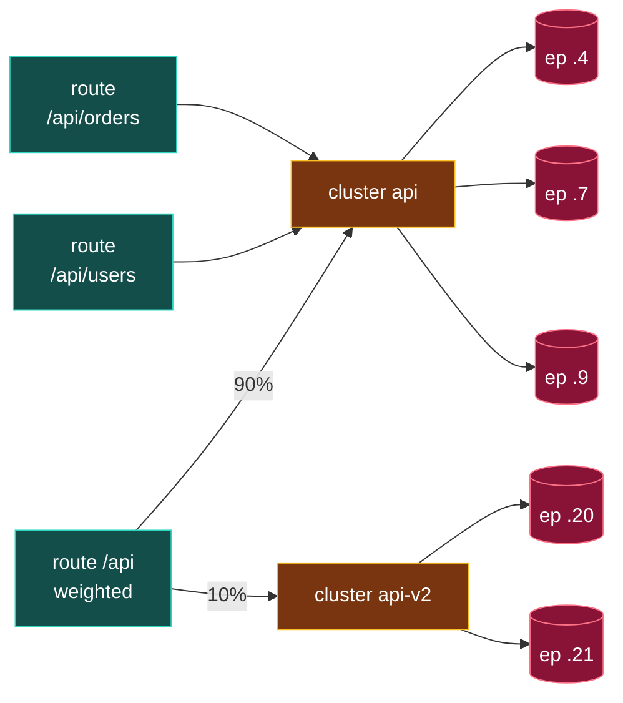

**English** | [日本語](README.ja.md)

# 05. CDS (Cluster Discovery Service)

CDS discovers **Clusters**: named pools of upstream hosts that Envoy can route to. A cluster defines *what* a backend is and *how* to talk to it (load balancing policy, timeouts, health checks, TLS, circuit breakers): but, crucially, it can defer *which* hosts back it to EDS.


## How a cluster discovers its endpoints

The cluster's `type` field decides where endpoints come from:

| type                         | Endpoints come from                    | Used in                   |
| ---------------------------- | -------------------------------------- | ------------------------- |
| `STATIC`                     | inline `load_assignment` (literal IPs) | Lab 00, Lab 03 (loopback) |
| `STRICT_DNS` / `LOGICAL_DNS` | DNS resolution of a hostname           | Lab 00 upstream           |
| `EDS`                        | the EDS API                            | Labs 01, 02, 03           |

The EDS form is the interesting one. The cluster says "do not look for endpoints in me; ask EDS for a load assignment named X":

```yaml
- "@type": type.googleapis.com/envoy.config.cluster.v3.Cluster
  name: service_backend
  type: EDS                          # <- endpoints come from EDS
  connect_timeout: 1s
  lb_policy: ROUND_ROBIN
  eds_cluster_config:
    service_name: service_backend    # <- the EDS resource name to fetch
    eds_config: { ads: {} }          # <- over the ADS stream
```

## What else lives on a cluster

Everything about *connecting to* a backend that should not change when a single pod scales:

- **lb_policy**: `ROUND_ROBIN`, `LEAST_REQUEST`, `RING_HASH`, etc.
- **connect_timeout**, **health_checks**, **outlier_detection**.
- **circuit_breakers**: max connections / requests / retries.
- **transport_socket**: upstream TLS (often via SDS).

These are why CDS is separate from EDS: the *policy* for a backend is stable, while the *membership* of that backend churns. Push policy rarely (CDS), push membership constantly (EDS).

## A request, concretely

Watch where the cluster fits when a real request arrives:

```bash
curl https://shop.example.com/api/orders/42
```

```text
1. Listener :443 accepts the connection (TLS terminated)
2. HCM parses HTTP: :authority shop.example.com, :path /api/orders/42
3. Route matches host + prefix "/api"  ->  route to cluster "api"
4. Cluster "api" does the actual work (below) and forwards
5. Endpoint 10.0.1.7:8080 receives GET /api/orders/42
```

Steps 1-3 only *choose a cluster by name*. Everything in step 4 is the cluster's job, for this one request:

1. **Filter by health**: of `api`'s endpoints, skip `10.0.2.9` (failing health checks); healthy = `.4`, `.7`.
2. **Load-balance**: `ROUND_ROBIN` picks `10.0.1.7:8080`.
3. **Circuit breaker**: is `api` under its `max_requests`? If not, it is a 503 right here.
4. **Connection pool**: reuse a pooled connection to `.7`, or open one within `connect_timeout` (with upstream mTLS).
5. **Forward**: send `GET /api/orders/42` over that connection.

So the cluster is the **execution unit for one destination**: it turns "send to `api`" into "this healthy pod, this connection, these limits". The admin interface shows the same events from the cluster's point of view:

```text
api::10.0.1.7:8080::health_flags::healthy
api::10.0.1.7:8080::rq_total::37            # requests this endpoint served
api::10.0.2.9:8080::health_flags::/failed_active_hc   # excluded member
api::default_priority::max_requests::1024   # circuit breaker threshold
```

## How routes, clusters, and endpoints relate (cardinality)

None of these links are one-to-one:

| Relationship | Cardinality | Why |
| --- | --- | --- |
| cluster -> endpoint | 1 : N | a cluster is a pool; endpoints are its members |
| route -> cluster | 1 usual / N weighted | a route names one cluster, or splits across several by weight |
| cluster -> route | 1 : N | many routes can target the same cluster |



Read it as: many **routes converge** onto one cluster, a cluster **fans out** to many endpoints, and a single route fans out to multiple clusters only when you weight it (canary). Whatever the shape, a single request still ends at **exactly one endpoint**. This asymmetry is also why the layers stay independent: reshaping routes never touches the cluster or its endpoints, and pods scaling never touches the routes.

## Dependency rules

- CDS is the **first** thing sent on an ADS stream. A cluster must exist before the routes that target it and before the endpoints that fill it.
- A cluster of `type: EDS` with no endpoints yet is valid: it just has zero hosts and returns 503 until EDS provides some.
- `connect_timeout` is **required** and must be positive; `0` is a NACK.

## Inspecting it

```bash
# Cluster names + their discovery type and lb policy
curl -s localhost:9901/config_dump?resource=dynamic_active_clusters | \
  grep -E 'name|type|lb_policy'

# The runtime view: clusters and their current endpoints + health
curl -s localhost:9901/clusters | grep service_backend
```

## Gotchas

- **`type: EDS` but no `eds_cluster_config`** → NACK. If you ask for EDS you must say which service name and config source.
- **Bootstrap xDS cluster must speak HTTP/2.** The static cluster that points at your gRPC control plane needs `http2_protocol_options` (see the Lab 02 bootstrap): gRPC is HTTP/2. Forgetting this is a classic "control plane unreachable" bug.
- **Cluster warming**: when a new EDS cluster is added, Envoy "warms" it (fetches endpoints, runs health checks) before using it, so there is a brief window where it exists but is not yet serving.

## Try it

[Lab 02](../../labs/02-grpc-control-plane/README.md) serves this cluster over gRPC ADS. Watch the control-plane log: `SEND Cluster version="1"` arrives first, then `ACK Cluster`. Next: [06 EDS](../06-eds/README.md).
