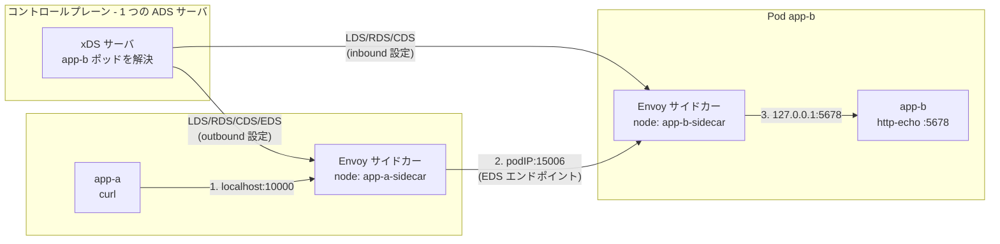

[English](README.md) | **日本語**

# 07 — Pod-to-pod: ミニサービスメッシュとしての xDS

ここですべてが結びつく。2 つのポッド — 呼び出し側（`app-a`）と呼ばれる側（`app-b`）— を取り、
各々に Envoy **サイドカー**を与え、1 つのコントロールプレーンに両方を構成させる。できあがるのは
最小のサービスメッシュで、すべてのホップが、いまや知っている 4 つの xDS API で構成される。

## サイドカーモデル

メッシュでは、各アプリインスタンスが Envoy サイドカーとネットワーク名前空間を共有する。
アプリのトラフィックは自分のサイドカーが代理する。

- **outbound（送信）**: アプリはローカルのポートを呼び、サイドカーが宛先のポッドへルーティングする。
- **inbound（受信）**: サイドカーは自ポッド宛のトラフィックを受け、ループバック経由でローカル
  アプリへ転送する。

つまり `app-a` から `app-b` への 1 リクエストは **2 つ**の Envoy を横断する。

## 全体像



1 リクエストを追う。

1. `app-a` が `localhost:10000` を curl する。そのポートは **自分の**サイドカーの
   **outbound listener**（LDS）だ。
2. `app-a` のサイドカーはルート（RDS）を `app-b` cluster（CDS）に一致させ、一つの
   `app-b` **ポッド IP のポート 15006** へロードバランスする — コントロールプレーンが
   Kubernetes から学んだ **EDS** エンドポイントだ。
3. `app-b` のサイドカーの **inbound listener**（LDS）が `:15006` で受け、ローカル cluster
   （CDS）へルーティング（RDS）し、`127.0.0.1:5678` — 本物の `app-b` アプリ — へ転送する。

## どの xDS API がどのホップを構成するか

| ホップ | サイドカー | 関与する xDS リソース |
| --- | --- | --- |
| app-a → 自サイドカー（`:10000`） | app-a (outbound) | **LDS** outbound listener |
| ルート + バックエンド選択 | app-a (outbound) | **RDS** → **CDS** `app-b` → **EDS** ポッド IP |
| app-b のサイドカーへ到達（`:15006`） | app-b (inbound) | **LDS** inbound listener |
| ローカルアプリへ転送 | app-b (inbound) | **RDS** → **CDS** `app-local`（STATIC `127.0.0.1:5678`） |

役割分担に注目。

- **呼び出し側**は **EDS** を多用する — app-b の入れ替わるポッド IP を追わねばならない。
- **呼ばれる側**は **STATIC** cluster を使う — 「自分のローカルアプリ」は常に
  `127.0.0.1:5678` で変わらないので、そこに EDS は要らない。

## 1 つのコントロールプレーン、2 つのアイデンティティ

両サイドカーは*同じ*コントロールプレーン、*同じ* ADS サーバに接続する。コントロールプレーンは
**node id** を根拠に**別々の**スナップショットを配る。

```text
stream 3 node=app-a-sidecar  ACK Cluster              version="4"
stream 3 node=app-a-sidecar  ACK Listener             version="4"
stream 3 node=app-a-sidecar  ACK ClusterLoadAssignment version="4"
stream 4 node=app-b-sidecar  ACK Cluster              version="1"
stream 4 node=app-b-sidecar  ACK Listener             version="1"
```

このノードごとの設定こそコントロールプレーンの本質だ。各プロキシに対して、世界の正しいビューを
計算する。（Istio の Pilot はまさにこれを大規模にやり、Kubernetes Service・`VirtualService`・
`DestinationRule` などから設定を導出する。）

## エンドポイントはポッドに追従する

呼び出し側の EDS は生きている。Lab 03 のコントロールプレーンは `app-b` headless Service を
数秒ごとに解決し、ポッド集合が変わると再プッシュする。`app-b` をスケールすれば呼び出し側が
収束する。

```text
# kubectl scale deploy/app-b --replicas=3
app-b endpoints changed -> [10.244.1.3 10.244.1.4 10.244.1.7]
PUSH node=app-a-sidecar version=4 ...
# 以降のリクエストは 3 つの app-b ポッドにラウンドロビンで届く
```

これが章 06 の EDS の見返りで、いまや実 Kubernetes ポッド上で起きている。

## 本番メッシュへの対応付け

手作業で組んだものは、Istio/Envoy メッシュが自動化しているものだ。

| このラボ | 本番メッシュ（Istio） |
| --- | --- |
| ポッド内に手動のサイドカーコンテナ | 自動サイドカーインジェクション（または ambient） |
| `--service-node` フラグで node id | ポッドメタデータから node id |
| コントロールプレーンが headless DNS を解決 | Pilot が Kubernetes API を監視 |
| ハードコードされた outbound listener `:10000` | サービスごとの listener + `iptables` 捕捉 |
| 平文ホップ | サイドカー間の **SDS** による相互 TLS |

その下のプロトコル — ADS 上の LDS, RDS, CDS, EDS、version/nonce による ACK/NACK — は
**同一**だ。あなたはいまサービスメッシュのエンジンを理解している。

## やってみる

[Lab 03 — kind での pod-to-pod](../../labs/03-pod-to-pod-kind/README.ja.md) を最後まで実行する。
クラスタを作り、両アプリとコントロールプレーンをデプロイし、`app-a` から両サイドカー越しに
`app-b` へリクエストを送り、`app-b` をスケールして EDS が追従するのを見る。最後に
[用語集と参考文献](../99-glossary/README.ja.md) で締める。
