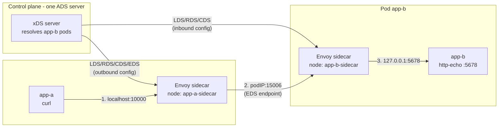

**English** | [日本語](README.ja.md)

# 07 — Pod-to-pod: xDS as a mini service mesh

This is where it all comes together. We take two pods — a caller (`app-a`) and a
callee (`app-b`) — give each an Envoy **sidecar**, and let a single control plane
program both. The result is a minimal service mesh, and every hop is configured
by the four xDS APIs you now know.

## The sidecar model

In a mesh, each app instance shares its network namespace with an Envoy sidecar.
The app's traffic is proxied by its own sidecar:

- **outbound**: the app calls a local port; its sidecar routes the request to the
  destination's pods.
- **inbound**: a sidecar accepts traffic for its pod and forwards to the local
  app over loopback.

So a single request from `app-a` to `app-b` crosses **two** Envoys.

## The full picture



Trace one request:

1. `app-a` curls `localhost:10000`. That port is **its own** sidecar's
   **outbound listener** (LDS).
2. `app-a`'s sidecar matches the route (RDS) to the `app-b` cluster (CDS) and
   load-balances to one `app-b` **pod IP on port 15006** — an **EDS** endpoint
   that the control plane learned from Kubernetes.
3. `app-b`'s sidecar **inbound listener** (LDS) on `:15006` receives it, routes
   (RDS) to the local cluster (CDS), and forwards to `127.0.0.1:5678` — the real
   `app-b` app.

## Which xDS API programs which hop

| Hop | Sidecar | xDS resources involved |
| --- | --- | --- |
| app-a → its sidecar (`:10000`) | app-a (outbound) | **LDS** outbound listener |
| route + pick a backend | app-a (outbound) | **RDS** → **CDS** `app-b` → **EDS** pod IPs |
| reach app-b's sidecar (`:15006`) | app-b (inbound) | **LDS** inbound listener |
| forward to local app | app-b (inbound) | **RDS** → **CDS** `app-local` (STATIC `127.0.0.1:5678`) |

Notice the division of labor:

- The **caller** side uses **EDS** heavily — it must track app-b's churning pod
  IPs.
- The **callee** side uses a **STATIC** cluster — "my local app" is always
  `127.0.0.1:5678`, it never changes, so no EDS is needed there.

## One control plane, two identities

Both sidecars connect to the *same* control plane and the *same* ADS server. The
control plane serves them **different** snapshots based on their **node id**:

```text
stream 3 node=app-a-sidecar  ACK Cluster              version="4"
stream 3 node=app-a-sidecar  ACK Listener             version="4"
stream 3 node=app-a-sidecar  ACK ClusterLoadAssignment version="4"
stream 4 node=app-b-sidecar  ACK Cluster              version="1"
stream 4 node=app-b-sidecar  ACK Listener             version="1"
```

This per-node config is the essence of a control plane: it computes the right
view of the world for each proxy. (Istio's Pilot does exactly this, at scale,
deriving config from Kubernetes Services, `VirtualService`, `DestinationRule`,
etc.)

## Endpoints follow the pods

The caller's EDS is alive. The control plane in Lab 03 resolves the `app-b`
headless Service every few seconds and re-pushes when the pod set changes. Scale
`app-b` and the caller converges:

```text
# kubectl scale deploy/app-b --replicas=3
app-b endpoints changed -> [10.244.1.3 10.244.1.4 10.244.1.7]
PUSH node=app-a-sidecar version=4 ...
# subsequent requests now hit all three app-b pods, round-robin
```

This is the EDS payoff from chapter 06, now on real Kubernetes pods.

## How this maps to production meshes

What you built by hand is what Istio/Envoy meshes automate:

| This lab | Production mesh (Istio) |
| --- | --- |
| manual sidecar container in the pod | automatic sidecar injection (or ambient) |
| node id via `--service-node` flag | node id from pod metadata |
| control plane resolves headless DNS | Pilot watches the Kubernetes API |
| hardcoded outbound listener `:10000` | per-service listeners + `iptables` capture |
| plaintext hop | mutual TLS via **SDS** between sidecars |

The protocol underneath — LDS, RDS, CDS, EDS over ADS, with version/nonce
ACK/NACK — is **identical**. You now understand the engine of a service mesh.

## Try it

Run [Lab 03 — pod-to-pod on kind](../../labs/03-pod-to-pod-kind/README.md)
end-to-end: create the cluster, deploy both apps and the control plane, send a
request from `app-a` through both sidecars to `app-b`, then scale `app-b` and
watch EDS track it. Wrap up with the
[glossary and references](../99-glossary/README.md).
