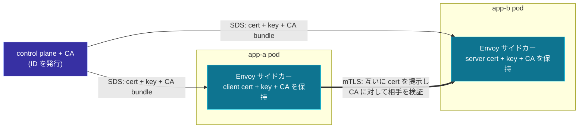

[English](README.md) | **日本語**

# 08. セキュリティ: SDS と相互 TLS

[Lab 03](../../labs/03-pod-to-pod-kind/README.ja.md) の pod-to-pod ホップは**平文**だ。
これは意図的で、xDS の仕組みに集中するためだった。だが本物のサービスメッシュは、すべての
ホップを**相互 TLS（mTLS）**で暗号化・認証し、その証明書は 5 つ目のディスカバリサービス
**SDS** が配信する。この章は、これまでの全部の上に載せるセキュリティ層だ。概念中心（ラボなし）
だが、すでに理解した listener と cluster に直接はまる。

## SDS: 5 つ目の xDS

**SDS（Secret Discovery Service）** は **Secret** を配信する。TLS 証明書、秘密鍵、信頼する
CA バンドルだ。プロトコルは他と同じ（DiscoveryRequest / DiscoveryResponse、バージョン、
ACK/NACK、通常 ADS 経由）。

そもそもなぜ証明書をファイルマウントでなく xDS で配るのか。

- **再起動なしのローテーション。** ワークロード証明書は短命（多くは数時間）。SDS は期限切れ前に
  新しい証明書をプッシュし、Envoy は稼働中の listener 上で、ドレインも再起動もなく差し替える。
- **秘密鍵をディスクに置かない。** 鍵は（localhost の）SDS gRPC ストリームで Envoy のメモリに
  届き、ポッドのファイルシステムには書かれない。

## mTLS: 双方が身元を証明する

通常の TLS は**サーバ**だけを認証する（クライアントがサーバ証明書を確認）。**相互** TLS は逆も
足す。**クライアントも証明書を提示**し、サーバがそれを検証する。メッシュでは、各サイドカーが
相手に自分のワークロード ID を証明することになる。



ID は証明書の SAN（subject alternative name）に入る。よくある方式が **SPIFFE** で、SAN が
`spiffe://cluster.local/ns/default/sa/app-a` のような URI になる。つまり「呼び出し側は許可されて
いるか」が「その証明書は自分を `app-a` と名乗り、うちの CA が署名しているか」になる。ネット
ワークでは偽造できない認証だ。

## どこに付くか: 同じ listener と cluster

mTLS はデータパスの新しいリソース型ではない。前の章のオブジェクトに `transport_socket` を
くっつけ、その証明書を SDS に向けるだけだ。

**呼ばれる側（inbound listener, LDS）。** filter chain に downstream TLS コンテキストを付け、
サーバ証明書を提示し、クライアント証明書を*要求*する。

```yaml
# inbound listener の filter_chain に
transport_socket:
  name: envoy.transport_sockets.tls
  typed_config:
    "@type": type.googleapis.com/envoy.extensions.transport_sockets.tls.v3.DownstreamTlsContext
    require_client_certificate: true        # <- これが *相互* にする鍵
    common_tls_context:
      tls_certificate_sds_secret_configs:   # <- 自分のサーバ証明書、SDS 経由
        - { name: app-b-cert, sds_config: { ads: {} } }
      validation_context_sds_secret_config: # <- 信頼する CA、SDS 経由
        { name: trusted-ca, sds_config: { ads: {} } }
```

**呼び出し側（outbound cluster, CDS）。** cluster に upstream TLS コンテキストを付け、
クライアント証明書を提示し、サーバを検証する。

```yaml
# outbound cluster に
transport_socket:
  name: envoy.transport_sockets.tls
  typed_config:
    "@type": type.googleapis.com/envoy.extensions.transport_sockets.tls.v3.UpstreamTlsContext
    common_tls_context:
      tls_certificate_sds_secret_configs:
        - { name: app-a-cert, sds_config: { ads: {} } }
      validation_context_sds_secret_config:
        { name: trusted-ca, sds_config: { ads: {} } }
```

全体像はこうだ: **LDS** が listener を、**RDS/CDS/EDS** がルーティングとバックエンド到達を、
**SDS** が通信路の保護を与える。すべて同じ ADS ストリーム上で。

## Lab 03 と Istio への対応

| Lab 03（このリポジトリ） | mTLS あり / 本番メッシュ |
| --- | --- |
| 平文ホップ `app-a -> app-b` | mTLS ホップ、双方が cert 検証 |
| ID なし | 証明書 SAN の SPIFFE SVID |
| 制御プレーンが LDS/RDS/CDS/EDS を配信 | さらに **SDS** secret を配信、毎時ローテート |
| 信頼 = 「ポッド IP に届いた」 | 信頼 = 「証明書がワークロードを証明」 |

Istio ではこれが自動だ。制御プレーン（istiod）が CA も兼ね、ワークロードごとに短命の SVID を
発行し、サイドカーが SDS で取得する。足すデータプレーン設定は、まさに上の 2 つの
`transport_socket` ブロックだ。

## なぜこのリポジトリのラボは平文のままか

mTLS を動かすには CA・secret を配る制御プレーン・証明書ローテーションが要り、可動部品が 3 倍に
増えて xDS の学びが埋もれる。正直なトレードはこうだ: ラボは**設定がどう発見・適用されるか**を
教える。この章は、その結果を安全なメッシュに変える**通信路レベルの 1 つの追加**を伝える。さらに
進めたいなら、次の一手は Lab 03 の制御プレーンを `SecretType` リソースも配るよう拡張し、上の
`transport_socket` ブロックを足すことだ。

## やってみる

この章にラボはない。[用語集と参考文献](../99-glossary/README.ja.md) へ進むか、
[07 pod-to-pod](../07-pod-to-pod/README.ja.md) に戻って各ホップが mTLS で包まれる様子を
思い描いてほしい。
