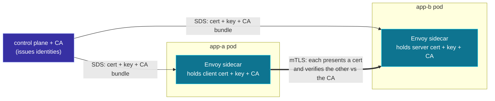

**English** | [日本語](README.ja.md)

# 08. Security: SDS and mutual TLS

The pod-to-pod hop in [Lab 03](../../labs/03-pod-to-pod-kind/README.md) is
**plaintext**. That was deliberate: it keeps the xDS mechanics in focus. But a
real service mesh encrypts and authenticates every hop with **mutual TLS
(mTLS)**, and the certificates are delivered by a fifth discovery service:
**SDS**. This chapter is the security layer you would add on top of everything so
far. It is conceptual (no lab), but it slots directly onto the listeners and
clusters you already understand.

## SDS: the fifth xDS

**SDS (Secret Discovery Service)** discovers **Secrets**: TLS certificates,
private keys, and trusted CA bundles. It is the same protocol as the others
(DiscoveryRequest / DiscoveryResponse, versions, ACK/NACK, usually over ADS).

Why deliver certs over xDS at all, instead of mounting files?

- **Rotation without restart.** Workload certs are short-lived (often hours). SDS
  pushes a fresh cert before the old one expires; Envoy swaps it on the live
  listener with no drain, no restart.
- **No private keys on disk.** The key travels over the (localhost) SDS gRPC
  stream to Envoy's memory, never written to the pod filesystem.

## mTLS: both sides prove who they are

Plain TLS authenticates only the **server** (the client checks the server's
cert). **Mutual** TLS adds the reverse: the **client also presents a cert**, and
the server verifies it. In a mesh, that means each sidecar proves its workload
identity to the other.



The identity lives in the certificate's SAN (subject alternative name). A common
scheme is **SPIFFE**, where the SAN is a URI like
`spiffe://cluster.local/ns/default/sa/app-a`. So "is the caller allowed?" becomes
"does its cert say it is `app-a`, signed by our CA?" That is authentication the
network cannot forge.

## Where it attaches: the same listeners and clusters

mTLS is not a new resource type in the data path. It is a `transport_socket`
bolted onto the objects from earlier chapters, with its certs pointed at SDS.

**Callee side (inbound listener, LDS).** The filter chain gets a downstream TLS
context that presents a server cert and *requires* a client cert:

```yaml
# on the inbound listener's filter_chain
transport_socket:
  name: envoy.transport_sockets.tls
  typed_config:
    "@type": type.googleapis.com/envoy.extensions.transport_sockets.tls.v3.DownstreamTlsContext
    require_client_certificate: true        # <- this is what makes it *mutual*
    common_tls_context:
      tls_certificate_sds_secret_configs:   # <- my server cert, via SDS
        - { name: app-b-cert, sds_config: { ads: {} } }
      validation_context_sds_secret_config: # <- the CA I trust, via SDS
        { name: trusted-ca, sds_config: { ads: {} } }
```

**Caller side (outbound cluster, CDS).** The cluster gets an upstream TLS context
that presents a client cert and validates the server:

```yaml
# on the outbound cluster
transport_socket:
  name: envoy.transport_sockets.tls
  typed_config:
    "@type": type.googleapis.com/envoy.extensions.transport_sockets.tls.v3.UpstreamTlsContext
    common_tls_context:
      tls_certificate_sds_secret_configs:
        - { name: app-a-cert, sds_config: { ads: {} } }
      validation_context_sds_secret_config:
        { name: trusted-ca, sds_config: { ads: {} } }
```

So the full picture is: **LDS** gives you the listener, **RDS/CDS/EDS** route and
reach the backend, and **SDS** secures the wire, all on the same ADS stream.

## How this maps to Lab 03 and to Istio

| Lab 03 (this repo) | With mTLS / production mesh |
| --- | --- |
| plaintext hop `app-a -> app-b` | mTLS hop, both sides cert-verified |
| no identity | SPIFFE SVID in the cert SAN |
| control plane pushes LDS/RDS/CDS/EDS | also pushes **SDS** secrets, rotated hourly |
| trust = "you reached the pod IP" | trust = "the cert proves the workload" |

In Istio this is automatic: the control plane (istiod) is also a CA, it mints a
short-lived SVID per workload, and the sidecars fetch it over SDS. The data-plane
config you would add is exactly the two `transport_socket` blocks above.

## Why this repo's labs stay plaintext

Running mTLS needs a CA, a secret-serving control plane, and cert rotation, which
would triple the moving parts and bury the xDS lesson. The honest trade is: the
labs teach **how config is discovered and applied**; this chapter tells you the
**one transport-level addition** that turns the result into a secure mesh. If you
want to go further, the next step is extending the Lab 03 control plane to also
serve `SecretType` resources and adding the `transport_socket` blocks above.

## Try it

There is no lab for this chapter. Continue to the
[glossary and references](../99-glossary/README.md), or revisit
[07 pod-to-pod](../07-pod-to-pod/README.md) and picture each hop wrapped in
mTLS.
