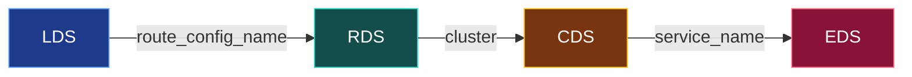

**English** | [日本語](README.ja.md)

# 99. Glossary & references

## Glossary

| Term | Meaning |
| --- | --- |
| **xDS** | Family of "x Discovery Service" APIs Envoy uses to fetch config dynamically. |
| **Data plane** | The proxy moving request bytes (Envoy). On the hot path. |
| **Control plane** | The service that computes and pushes config to the data plane. Off the hot path. |
| **Bootstrap** | The static config file Envoy reads at startup; minimally, how to reach the control plane. |
| **Listener** | A socket Envoy binds plus the filter chains that process its traffic. Served by **LDS**. |
| **Filter chain** | Ordered network filters applied to a connection; for HTTP, the HTTP connection manager. |
| **HCM** | HTTP connection manager: the L7 filter that parses HTTP and runs routing. |
| **RouteConfiguration** | Virtual hosts + routes that match a request to a cluster. Served by **RDS**. |
| **Cluster** | A named upstream pool with its connection policy. Served by **CDS**. |
| **ClusterLoadAssignment** | The endpoint list (IPs, health, locality) behind a cluster. Served by **EDS**. |
| **Endpoint** | One concrete upstream `ip:port`. |
| **ADS** | Aggregated Discovery Service: all resource types on one ordered gRPC stream. |
| **SotW** | State-of-the-World: each response carries the full set of resources for a type. |
| **Delta / Incremental** | Each response carries only added/removed resources. |
| **DiscoveryRequest** | Envoy → control plane message; requests resources and ACK/NACKs the last response. |
| **DiscoveryResponse** | Control plane → Envoy message; carries resources at a version, stamped with a nonce. |
| **version_info** | The config version Envoy has successfully applied. Echoed on ACK. |
| **nonce** | Identifier correlating a request (ACK/NACK) to the response it answers. |
| **ACK** | Envoy accepted and applied a pushed config version. |
| **NACK** | Envoy rejected a pushed config; it keeps the previous version and reports `error_detail`. |
| **node id** | How an Envoy identifies itself; the control plane keys per-proxy config on it. |
| **Sidecar** | An Envoy proxying a single co-located app's inbound/outbound traffic. |
| **Warming** | Envoy preparing a new cluster/listener (fetch endpoints, health-check) before serving with it. |
| **SDS** | Secret Discovery Service: delivers TLS certs/keys; powers mutual TLS in a mesh. |
| **go-control-plane** | The reference Go library for building xDS control planes (used in Labs 02-03). |

## How the four APIs relate (one-line recap)

Read it as: a listener names a route config, a route names a cluster, a cluster names an endpoint set. ADS sends them in that dependency order (CDS/EDS before LDS/RDS) so references never dangle.

## References

- Envoy: xDS protocol: <https://www.envoyproxy.io/docs/envoy/latest/api-docs/xds_protocol>
- Envoy: Listener / LDS: <https://www.envoyproxy.io/docs/envoy/latest/configuration/listeners/lds>
- Envoy: Route / RDS: <https://www.envoyproxy.io/docs/envoy/latest/configuration/http/http_conn_man/rds>
- Envoy: Cluster / CDS: <https://www.envoyproxy.io/docs/envoy/latest/configuration/upstream/cluster_manager/cds>
- Envoy: Endpoint / EDS: <https://www.envoyproxy.io/docs/envoy/latest/api-docs/xds_protocol#endpoint-discovery-service-eds>
- Envoy: Dynamic configuration sandboxes: <https://www.envoyproxy.io/docs/envoy/latest/start/sandboxes/dynamic-configuration-filesystem>
- Envoy: Admin interface: <https://www.envoyproxy.io/docs/envoy/latest/operations/admin>
- go-control-plane: <https://github.com/envoyproxy/go-control-plane>
- kind: <https://kind.sigs.k8s.io/>
- Istio architecture (a real xDS control plane): <https://istio.io/latest/docs/ops/deployment/architecture/>

Back to the [top README](../../README.md).
