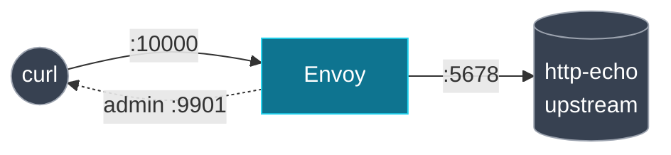

[English](README.md) | **日本語**

# Lab 00. 静的ブートストラップ

土台。1 つの静的ファイルで完全に構成された Envoy を 1 つ、1 つの upstream の前に置く。コントロールプレーンも xDS もない。リクエストを通し、管理インターフェースから 4 つのオブジェクト種別を読み出す。リポジトリ残りの「Before」の絵だ。

[docs 01 Envoy 設定モデル](../../docs/01-envoy-config-model/README.ja.md) と対応。

## ここにあるもの

| ファイル              | 役割                                                  |
| --------------------- | ----------------------------------------------------- |
| `envoy.yaml`          | 設定の全部: 静的な listener, route, cluster, endpoint |
| `docker-compose.yaml` | Envoy + 1 つの `http-echo` upstream                   |

## トポロジ



## 実行する

```bash
cd labs/00-static-bootstrap
docker compose up -d
```

Envoy 越しにリクエストを送る:

```bash
curl -s localhost:10000/
# hello from upstream (static endpoint)
```

## 4 つのオブジェクト種別を確認する

この設定は完全に静的だが、Envoy は各オブジェクトを所有する API ごとに状態を整理している。

```bash
curl -s localhost:9901/config_dump | \
  grep -o '"@type": "[^"]*ConfigDump"' | sort -u
```

```text
"@type": "type.googleapis.com/envoy.admin.v3.BootstrapConfigDump"
"@type": "type.googleapis.com/envoy.admin.v3.ClustersConfigDump"
"@type": "type.googleapis.com/envoy.admin.v3.ListenersConfigDump"
"@type": "type.googleapis.com/envoy.admin.v3.RoutesConfigDump"
```

cluster とその唯一のエンドポイントを見る:

```bash
curl -s localhost:9901/clusters | grep service_backend | head
```

Envoy がインストールされていれば Docker なしで設定検証もできる:

```bash
envoy --mode validate -c envoy.yaml
# ... configuration 'envoy.yaml' OK
```

## 持ち帰り

- 完全なデータパスは **listener → route → cluster → endpoint** にすぎない。
- route は cluster を**名前で**参照し（`service_backend`）、endpoint は cluster の**中**にいる。次のラボはこれらを 1 つずつ外出しし、動的に配信する。xDS がやるのはそれだけだ。

## 片付け

```bash
docker compose down
```

次: [Lab 01 filesystem xDS](../01-filesystem-xds/README.ja.md)。
