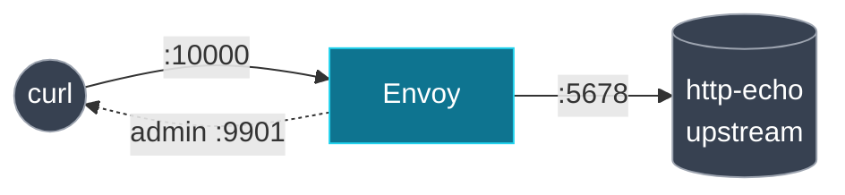

**English** | [日本語](README.ja.md)

# Lab 00. Static bootstrap

The baseline. One Envoy, fully configured by a single static file, in front of one upstream. No control plane, no xDS. You will run a request through it and read the four object types out of the admin interface: the "before" picture for the rest of the repo.

Pairs with [docs 01 Envoy config model](../../docs/01-envoy-config-model/README.md).

## What is here

| File                  | Role                                                          |
| --------------------- | ------------------------------------------------------------- |
| `envoy.yaml`          | the whole config: a static listener, route, cluster, endpoint |
| `docker-compose.yaml` | Envoy + one `http-echo` upstream                              |

## The topology



## Run it

```bash
cd labs/00-static-bootstrap
docker compose up -d
```

Send a request through Envoy:

```bash
curl -s localhost:10000/
# hello from upstream (static endpoint)
```

## Inspect the four object types

Envoy organizes its state by the API that owns each object, even though this config is fully static:

```bash
curl -s localhost:9901/config_dump | \
  grep -o '"@type": "[^"]*ConfigDump"' | sort -u
```

```text
"@type": "type.googleapis.com/envoy.admin.v3.BootstrapConfigDump"
"@type": "type.googleapis.com/envoy.admin.v3.ClustersConfigDump"
"@type": "type.googleapis.com/envoy.admin.v3.ListenersConfigDump"
"@type": "type.googleapis.com/envoy.admin.v3.RoutesConfigDump"
```

See the cluster and its single endpoint:

```bash
curl -s localhost:9901/clusters | grep service_backend | head
```

You can also validate the config without Docker if you have Envoy installed:

```bash
envoy --mode validate -c envoy.yaml
# ... configuration 'envoy.yaml' OK
```

## What to take away

- A complete data path is just **listener → route → cluster → endpoint**.
- The route references the cluster **by name** (`service_backend`); the endpoint lives **inside** the cluster. The next labs pull each of these out and deliver it dynamically: that is all xDS does.

## Teardown

```bash
docker compose down
```

Next: [Lab 01 filesystem xDS](../01-filesystem-xds/README.md).
