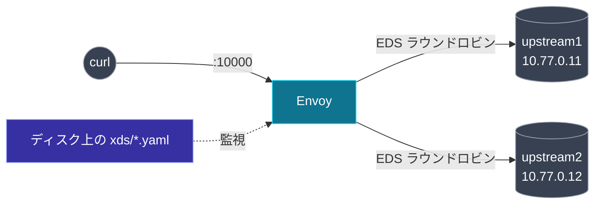

[English](README.md) | **日本語**

# Lab 01 — Filesystem xDS

考えうる最も単純な「コントロールプレーン」: ディスク上のファイルと、あなたのテキストエディタ。
Envoy は listener / route / cluster / endpoint をファイルから発見し、変更時にホットリロードする。
gRPC もコードもない — だから各 xDS リソースが*何*であるかだけに集中できる。

[docs 02（概観）](../../docs/02-xds-overview/README.ja.md)、
[03（LDS）](../../docs/03-lds/README.ja.md)、[04（RDS）](../../docs/04-rds/README.ja.md) と対応。

## ここにあるもの

| ファイル | xDS API | 中身 |
| --- | --- | --- |
| `bootstrap.yaml` | — | LDS/CDS を `xds/` ディレクトリに向けるだけ |
| `xds/lds.yaml` | LDS | listener（ルーティングは RDS へ引き継ぐ） |
| `xds/rds.yaml` | RDS | route config `local_route` |
| `xds/cds.yaml` | CDS | cluster `service_backend`（type EDS） |
| `xds/eds.yaml` | EDS | 2 つのエンドポイント |
| `reload.sh` | — | ホットリロードを確実に発火させるヘルパー（注記参照） |
| `variants/` | — | 実験用の代替リソースファイル |

## トポロジ



## 実行する

```bash
cd labs/01-filesystem-xds
docker compose up -d
```

数回リクエストを送る。EDS が両 upstream にロードバランスする:

```bash
for i in $(seq 1 6); do curl -s localhost:10000/; done
```

```text
hello from upstream2
hello from upstream2
hello from upstream1
hello from upstream2
hello from upstream1
hello from upstream1
```

## EDS の変化をライブで見る

cluster を 1 エンドポイントに縮め、ルーティングが追従するのを見る — **Envoy を再起動せずに**。

```bash
./reload.sh eds.yaml variants/eds-one-endpoint.yaml
# swapped eds.yaml inside container 'envoy'. Envoy will hot-reload within ~1s.

curl -s localhost:9901/clusters | grep -oE '10\.77\.0\.[0-9]+:5678' | sort -u
# 10.77.0.11:5678        <- いまはエンドポイント 1 つだけ

for i in $(seq 1 4); do curl -s localhost:10000/; done
# 応答はすべて "upstream1" になる
```

両エンドポイントを復元:

```bash
./reload.sh eds.yaml xds/eds.yaml
```

### なぜファイルを直接編集せず `reload.sh` を使うのか

Envoy は `xds/` ディレクトリを inotify で監視する。Docker Desktop / Rancher Desktop では、
**ホスト側のファイル編集の inotify イベントが Linux VM に伝播しない**ため、エディタでの編集に
Envoy が気づかない。`reload.sh` はファイルの入れ替えを*コンテナ内で*行う（監視ディレクトリへの
アトミックな `mv`）。これで Envoy が動くのと同じカーネルでイベントが発火する。ネイティブ Linux
ではファイルを直接編集しても効く。

## 試すこと

- `xds/rds.yaml` を編集して 2 つ目の route を足し、リロードし、listener が一度も再起動して
  いないことを確かめる（route config のバージョンが上がる間も `/config_dump` の listener
  `version_info` は不変）。
- `xds/lds.yaml` の `port_value` を変え、リロードし、`/listeners` でバインドポートが変わるのを見る。

## 片付け

```bash
docker compose down
```

次: [Lab 02 — gRPC コントロールプレーン](../02-grpc-control-plane/README.ja.md)。
