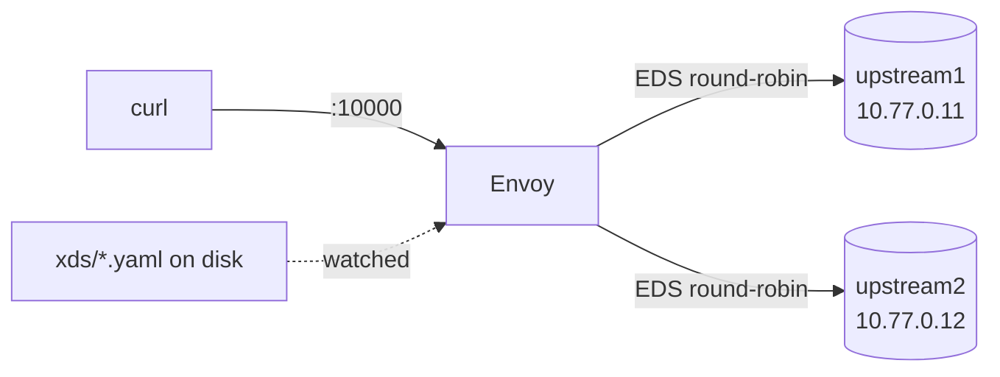

**English** | [日本語](README.ja.md)

# Lab 01 — Filesystem xDS

The simplest possible "control plane": files on disk, and your text editor. Envoy
discovers its listeners, routes, clusters, and endpoints from files and
hot-reloads when they change. No gRPC, no code — so you can focus entirely on
*what* each xDS resource is.

Pairs with [docs 02 (overview)](../../docs/02-xds-overview/README.md),
[03 (LDS)](../../docs/03-lds/README.md), and [04 (RDS)](../../docs/04-rds/README.md).

## What is here

| File | xDS API | Holds |
| --- | --- | --- |
| `bootstrap.yaml` | — | only points LDS/CDS at the `xds/` directory |
| `xds/lds.yaml` | LDS | the listener (hands off routing to RDS) |
| `xds/rds.yaml` | RDS | the route config `local_route` |
| `xds/cds.yaml` | CDS | the cluster `service_backend` (type EDS) |
| `xds/eds.yaml` | EDS | two endpoints |
| `reload.sh` | — | helper to trigger a hot reload reliably (see note) |
| `variants/` | — | alternate resource files for experiments |

## The topology



## Run it

```bash
cd labs/01-filesystem-xds
docker compose up -d
```

Send a few requests; EDS load-balances across both upstreams:

```bash
for i in $(seq 1 6); do curl -s localhost:10000/; done
```

```text
hello from upstream2
hello from upstream2
hello from upstream1
hello from upstream2
hello from upstream1
hello from upstream1
```

## Watch EDS change live

Shrink the cluster to a single endpoint and watch routing follow — **without
restarting Envoy**:

```bash
./reload.sh eds.yaml variants/eds-one-endpoint.yaml
# swapped eds.yaml inside container 'envoy'. Envoy will hot-reload within ~1s.

curl -s localhost:9901/clusters | grep -oE '10\.77\.0\.[0-9]+:5678' | sort -u
# 10.77.0.11:5678        <- only one endpoint now

for i in $(seq 1 4); do curl -s localhost:10000/; done
# all responses now say "upstream1"
```

Restore both endpoints:

```bash
./reload.sh eds.yaml xds/eds.yaml
```

### Why `reload.sh` instead of editing the file directly?

Envoy watches the `xds/` directory with inotify. On Docker Desktop / Rancher
Desktop, **host-side file edits do not propagate inotify events into the Linux
VM**, so Envoy never notices an edit you make in your editor. `reload.sh`
performs the file swap *inside the container* (an atomic `mv` into the watched
directory), which fires the event in the same kernel Envoy runs in. On native
Linux, editing the file directly works too.

## Things to try

- Edit `xds/rds.yaml` to add a second route, reload, and confirm the listener
  never restarted (`/config_dump` listener `version_info` is unchanged while the
  route config version bumps).
- Edit `xds/lds.yaml`'s `port_value`, reload, and watch the bound port change in
  `/listeners`.

## Teardown

```bash
docker compose down
```

Next: [Lab 02 — gRPC control plane](../02-grpc-control-plane/README.md).
