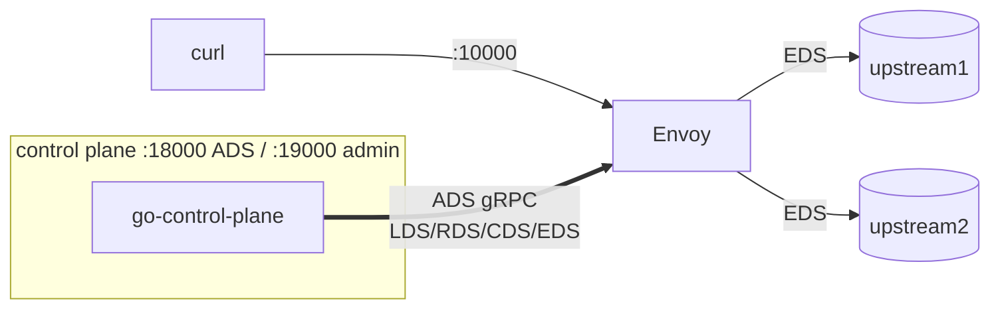

[English](README.md) | **日本語**

# Lab 02 — gRPC コントロールプレーン (go-control-plane)

本物のコントロールプレーン。[`go-control-plane`](https://github.com/envoyproxy/go-control-plane)
で作った小さな Go プログラムが、LDS + RDS + CDS + EDS を 1 本の **ADS gRPC ストリーム**で
Envoy に配る。HTTP admin から操作し、Envoy の **ACK** と **NACK** をリアルタイムで見る。

[docs 05（CDS）](../../docs/05-cds/README.ja.md)、[06（EDS）](../../docs/06-eds/README.ja.md) と対応し、
章 [02（概観）](../../docs/02-xds-overview/README.ja.md) を実体化する。

## ここにあるもの

| パス | 役割 |
| --- | --- |
| `bootstrap.yaml` | Envoy: コントロールプレーンを指す静的 `xds_cluster`（HTTP/2）だけ |
| `control-plane/` | Go の ADS サーバ（`main.go`, `resources.go`, `callbacks.go`） |
| `docker-compose.yaml` | コントロールプレーン + Envoy + 2 つの upstream |

## トポロジ



## 実行する

```bash
cd labs/02-grpc-control-plane
docker compose up -d --build      # Go コントロールプレーンのイメージをビルド
```

リクエストを送る。Envoy は完全に gRPC ストリームから構成されている:

```bash
for i in $(seq 1 6); do curl -s localhost:10000/; done
# upstream1 / upstream2 にラウンドロビン
```

## ADS ハンドシェイク（依存順序）を見る

```bash
docker compose logs control-plane
```

```text
stream 1   REQ envoy.config.cluster.v3.Cluster (initial)
stream 1  SEND envoy.config.cluster.v3.Cluster version="1" (1 resources)
stream 1   REQ envoy.config.endpoint.v3.ClusterLoadAssignment (initial)
stream 1  SEND envoy.config.endpoint.v3.ClusterLoadAssignment version="1" (1 resources)
stream 1   ACK envoy.config.cluster.v3.Cluster version="1"
stream 1  SEND envoy.config.listener.v3.Listener version="1" (1 resources)
stream 1   ACK envoy.config.endpoint.v3.ClusterLoadAssignment version="1"
stream 1  SEND envoy.config.route.v3.RouteConfiguration version="1" (1 resources)
stream 1   ACK envoy.config.listener.v3.Listener version="1"
stream 1   ACK envoy.config.route.v3.RouteConfiguration version="1"
```

順序に注目: **Cluster (CDS) → endpoints (EDS) → Listener (LDS) → routes (RDS)**、
各々の後に **ACK**。章 02 の「make before break」順序が、ワイヤ上で見えている。

## HTTP admin で操作する

```bash
# EDS を 1 エンドポイントに縮める（EDS プッシュ）
curl -XPOST localhost:19000/scale?n=1
for i in $(seq 1 3); do curl -s localhost:10000/; done   # いまは upstream1 のみ

# 不正な listener（ポート 70000）をプッシュ -> Envoy が NACK
curl -XPOST localhost:19000/break

# 妥当な listener を再プッシュ -> Envoy が ACK
curl -XPOST localhost:19000/heal

# 2 エンドポイントに戻す
curl -XPOST localhost:19000/scale?n=2
```

## NACK を見る

`/break` の後、コントロールプレーンのログに Envoy が更新を拒否する様子が出る:

```text
stream 1  NACK envoy.config.listener.v3.Listener version="2": goo.gle/debugonly
```

人間が読める理由はコントロールプレーン側では伏せられている。Envoy 自身のログにある:

```bash
docker compose logs envoy | grep -i rejected
```

```text
gRPC config for ...Listener rejected:
  ... SocketAddressValidationError.PortValue: value must be less than or equal to 65535
```

決定的な性質: **NACK は安全**。Envoy は直前の正常な listener（`version="1"`）を配り続けるので、
その間も `curl localhost:10000` は動く。

## コントロールプレーンの仕組み

- `resources.go` が 4 つのリソース型を protobuf メッセージとして組み立てる。
- `main.go` がそれらを Envoy の **node id**（`lab02-node`）でキーした `Snapshot` に入れ、
  ADS サーバから配る。`/scale`・`/break`・`/heal` のたびに新バージョンでスナップショットを
  作り直し、再プッシュする。
- `callbacks.go` が全 `DiscoveryRequest` をログに出し、ACK/NACK ループを上で見た行に変える。

## 片付け

```bash
docker compose down
```

次: [Lab 03 — kind での pod-to-pod](../03-pod-to-pod-kind/README.ja.md)。
