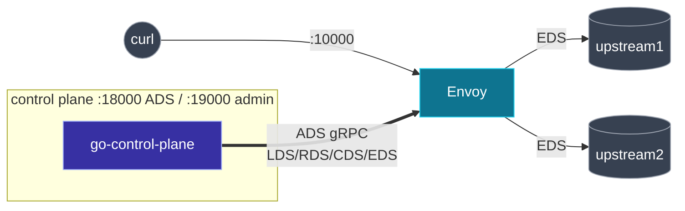

**English** | [日本語](README.ja.md)

# Lab 02. gRPC control plane (go-control-plane)

A real control plane. A small Go program built on [`go-control-plane`](https://github.com/envoyproxy/go-control-plane) serves LDS + RDS + CDS + EDS to Envoy over a single **ADS gRPC stream**. You drive it through an HTTP admin and watch Envoy **ACK** and **NACK** in real time.

Pairs with [docs 05 (CDS)](../../docs/05-cds/README.md) and [06 (EDS)](../../docs/06-eds/README.md), and brings chapter [02 (overview)](../../docs/02-xds-overview/README.md) to life.

## What is here

| Path                  | Role                                                                        |
| --------------------- | --------------------------------------------------------------------------- |
| `bootstrap.yaml`      | Envoy: only the static `xds_cluster` (HTTP/2) pointing at the control plane |
| `control-plane/`      | the Go ADS server (`main.go`, `resources.go`, `callbacks.go`)               |
| `docker-compose.yaml` | control plane + Envoy + two upstreams                                       |

## The topology



## Run it

```bash
cd labs/02-grpc-control-plane
docker compose up -d --build      # builds the Go control plane image
```

Send requests; Envoy is configured entirely from the gRPC stream:

```bash
for i in $(seq 1 6); do curl -s localhost:10000/; done
# round-robin across upstream1 / upstream2
```

## Watch the ADS handshake (dependency ordering)

```bash
docker compose logs control-plane
```

```text
stream 1   REQ envoy.config.cluster.v3.Cluster (initial)
stream 1  SEND envoy.config.cluster.v3.Cluster version="1" (1 resources)
stream 1   REQ envoy.config.endpoint.v3.ClusterLoadAssignment (initial)
stream 1  SEND envoy.config.endpoint.v3.ClusterLoadAssignment version="1" (1 resources)
stream 1   ACK envoy.config.cluster.v3.Cluster version="1"
stream 1  SEND envoy.config.listener.v3.Listener version="1" (1 resources)
stream 1   ACK envoy.config.endpoint.v3.ClusterLoadAssignment version="1"
stream 1  SEND envoy.config.route.v3.RouteConfiguration version="1" (1 resources)
stream 1   ACK envoy.config.listener.v3.Listener version="1"
stream 1   ACK envoy.config.route.v3.RouteConfiguration version="1"
```

Note the order: **Cluster (CDS) → endpoints (EDS) → Listener (LDS) → routes (RDS)**, each followed by an **ACK**. That is the "make before break" ordering from chapter 02, visible on the wire.

## Drive it via the HTTP admin

```bash
# Shrink EDS to one endpoint (an EDS push)
curl -XPOST localhost:19000/scale?n=1
for i in $(seq 1 3); do curl -s localhost:10000/; done   # only upstream1 now

# Push an invalid listener (port 70000) -> Envoy NACKs
curl -XPOST localhost:19000/break

# Push a valid listener again -> Envoy ACKs
curl -XPOST localhost:19000/heal

# Back to two endpoints
curl -XPOST localhost:19000/scale?n=2
```

## See a NACK

After `/break`, the control plane log shows Envoy rejecting the update:

```text
stream 1  NACK envoy.config.listener.v3.Listener version="2": goo.gle/debugonly
```

The human-readable reason is redacted on the control-plane side; it lives in Envoy's own log:

```bash
docker compose logs envoy | grep -i rejected
```

```text
gRPC config for ...Listener rejected:
  ... SocketAddressValidationError.PortValue: value must be less than or equal to 65535
```

The key property: **a NACK is safe**. Envoy keeps serving the last good listener (`version="1"`), so `curl localhost:10000` still works throughout.

## How the control plane works

- `resources.go` builds the four resource types as protobuf messages.
- `main.go` puts them in a `Snapshot`, keyed by the Envoy **node id** (`lab02-node`), and serves it from the ADS server. Each `/scale`, `/break`, `/heal` rebuilds the snapshot with a new version and re-pushes.
- `callbacks.go` logs every `DiscoveryRequest`, turning the ACK/NACK loop into the lines you saw above.

## Teardown

```bash
docker compose down
```

Next: [Lab 03 pod-to-pod on kind](../03-pod-to-pod-kind/README.md).
