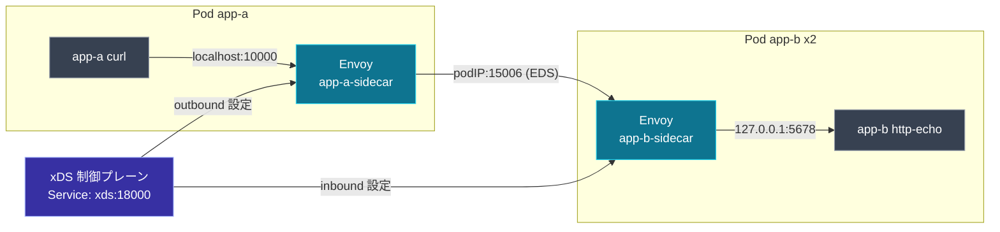

[English](README.md) | **日本語**

# Lab 03. kind での pod-to-pod

最終章。実 Kubernetes クラスタ（`kind`）上の 2 ポッド。各々に Envoy **サイドカー**を持ち、 1 つのメッシュ制御プレーンで結線される。`app-a` からのリクエストは **2 つ**の Envoy を越えて `app-b` に届き、`app-b` をスケールすると呼び出し側のエンドポイントが EDS でライブ更新される。

[docs 07 pod-to-pod](../../docs/07-pod-to-pod/README.ja.md) と対応。

## ここにあるもの

| パス | 役割 |
| --- | --- |
| `kind-cluster.yaml` | 2 ノードの kind クラスタ |
| `control-plane/` | メッシュ制御プレーン: ノードごとの設定を配り、app-b ポッドを解決 |
| `manifests/00-configmap-bootstrap.yaml` | 共有サイドカー bootstrap |
| `manifests/10-control-plane.yaml` | 制御プレーン Deployment + Service `xds` |
| `manifests/20-app-b.yaml` | app-b（http-echo）+ inbound サイドカー、headless Service |
| `manifests/30-app-a.yaml` | app-a（curl）+ outbound サイドカー |

## トポロジ



## 実行する

```bash
cd labs/03-pod-to-pod-kind

# 1. クラスタ
kind create cluster --config kind-cluster.yaml

# 2. 制御プレーンのイメージをビルドして kind に読み込む
docker build -t envoy-xds-mesh-cp:dev ./control-plane
kind load docker-image envoy-xds-mesh-cp:dev --name envoy-xds

# 3. すべてデプロイ
kubectl apply -f manifests/
kubectl wait --for=condition=Ready pod --all --timeout=120s
```

## pod-to-pod トラフィックを送る

`app-a` は自分のサイドカーの `localhost:10000` を curl する。リクエストは両サイドカーを横断し、 2 つの `app-b` ポッドにロードバランスされる:

```bash
for i in $(seq 1 6); do
  kubectl exec deploy/app-a -c app -- curl -s localhost:10000/
done
```

```text
hello from app-b (app-b-74f4fbc67d-rxh4w)
hello from app-b (app-b-74f4fbc67d-rxh4w)
hello from app-b (app-b-74f4fbc67d-snnmg)
hello from app-b (app-b-74f4fbc67d-snnmg)
hello from app-b (app-b-74f4fbc67d-rxh4w)
hello from app-b (app-b-74f4fbc67d-rxh4w)
```

2 つの異なるポッド名 = トラフィックが本当に app-b のポッド間で分散している。

## EDS がポッドを追うのを見る

`app-b` をスケールすると、制御プレーンが headless Service を再解決し、新しいエンドポイントを `app-a` のサイドカーへプッシュする:

```bash
kubectl scale deploy/app-b --replicas=3
kubectl wait --for=condition=Ready pod -l app=app-b --timeout=90s

kubectl logs deploy/xds | grep -E 'endpoints changed|PUSH node=app-a'
```

```text
app-b endpoints changed -> [10.244.1.3 10.244.1.4 10.244.1.7]
PUSH node=app-a-sidecar version=4 (cds=1 eds=1 rds=1 lds=1 resources)
```

応答に 3 つ目の異なるポッド名が現れる:

```bash
for i in $(seq 1 8); do
  kubectl exec deploy/app-a -c app -- curl -s localhost:10000/
done | sort | uniq -c
```

## 1 つの制御プレーン、2 つのノードアイデンティティ

両サイドカーは 1 つの ADS ストリームのエンドポイントを共有する。制御プレーンは `--service-node` を根拠に別々の設定を配る:

```bash
kubectl logs deploy/xds | grep -E 'node=app-(a|b).* ACK'
```

```text
stream 3 node=app-a-sidecar  ACK ...Listener version="4"
stream 3 node=app-a-sidecar  ACK ...ClusterLoadAssignment version="4"
stream 4 node=app-b-sidecar  ACK ...Cluster version="1"
stream 4 node=app-b-sidecar  ACK ...Listener version="1"
```

## メッシュ制御プレーンの仕組み

- `app-b-sidecar` には**静的**スナップショットを配る: `:15006` の inbound listener が STATIC cluster `127.0.0.1:5678`（ローカルアプリ）へルーティングする。
- `app-a-sidecar` には `:10000` の outbound listener が **EDS** cluster `app-b` へルーティングする設定を配る。その cluster のエンドポイントは、`app-b` headless Service の DNS を数秒ごとに解決して埋める。Kubernetes API を監視することの代役で、Istio の Pilot がやっていることだ。

## 片付け

```bash
kind delete cluster --name envoy-xds
```

これでリポジトリは終わり。[用語集](../../docs/99-glossary/README.ja.md) か [トップ README](../../README.ja.md) に戻ろう。
