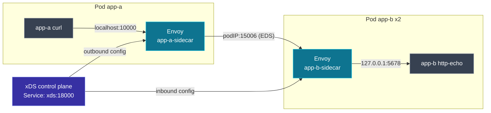

**English** | [日本語](README.ja.md)

# Lab 03 — Pod-to-pod on kind

The finale. Two pods on a real Kubernetes cluster (`kind`), each with an Envoy
**sidecar**, wired together by one mesh control plane. A request from `app-a`
reaches `app-b` through **two** Envoys, and scaling `app-b` updates the caller's
endpoints live via EDS.

Pairs with [docs 07 — pod-to-pod](../../docs/07-pod-to-pod/README.md).

## What is here

| Path | Role |
| --- | --- |
| `kind-cluster.yaml` | a 2-node kind cluster |
| `control-plane/` | mesh control plane: serves per-node config, resolves app-b pods |
| `manifests/00-configmap-bootstrap.yaml` | the shared sidecar bootstrap |
| `manifests/10-control-plane.yaml` | control plane Deployment + Service `xds` |
| `manifests/20-app-b.yaml` | app-b (http-echo) + inbound sidecar, headless Service |
| `manifests/30-app-a.yaml` | app-a (curl) + outbound sidecar |

## The topology



## Run it

```bash
cd labs/03-pod-to-pod-kind

# 1. cluster
kind create cluster --config kind-cluster.yaml

# 2. build the control plane image and load it into kind
docker build -t envoy-xds-mesh-cp:dev ./control-plane
kind load docker-image envoy-xds-mesh-cp:dev --name envoy-xds

# 3. deploy everything
kubectl apply -f manifests/
kubectl wait --for=condition=Ready pod --all --timeout=120s
```

## Send pod-to-pod traffic

`app-a` curls its own sidecar at `localhost:10000`; the request traverses both
sidecars and is load-balanced across the two `app-b` pods:

```bash
for i in $(seq 1 6); do
  kubectl exec deploy/app-a -c app -- curl -s localhost:10000/
done
```

```text
hello from app-b (app-b-74f4fbc67d-rxh4w)
hello from app-b (app-b-74f4fbc67d-rxh4w)
hello from app-b (app-b-74f4fbc67d-snnmg)
hello from app-b (app-b-74f4fbc67d-snnmg)
hello from app-b (app-b-74f4fbc67d-rxh4w)
hello from app-b (app-b-74f4fbc67d-rxh4w)
```

Two distinct pod names = traffic really is balancing across app-b's pods.

## Watch EDS track the pods

Scale `app-b` and the control plane re-resolves its headless Service and pushes
new endpoints to `app-a`'s sidecar:

```bash
kubectl scale deploy/app-b --replicas=3
kubectl wait --for=condition=Ready pod -l app=app-b --timeout=90s

kubectl logs deploy/xds | grep -E 'endpoints changed|PUSH node=app-a'
```

```text
app-b endpoints changed -> [10.244.1.3 10.244.1.4 10.244.1.7]
PUSH node=app-a-sidecar version=4 (cds=1 eds=1 rds=1 lds=1 resources)
```

Now a third distinct pod name appears in the responses:

```bash
for i in $(seq 1 8); do
  kubectl exec deploy/app-a -c app -- curl -s localhost:10000/
done | sort | uniq -c
```

## One control plane, two node identities

Both sidecars share one ADS stream endpoint; the control plane serves them
different config based on `--service-node`:

```bash
kubectl logs deploy/xds | grep -E 'node=app-(a|b).* ACK'
```

```text
stream 3 node=app-a-sidecar  ACK ...Listener version="4"
stream 3 node=app-a-sidecar  ACK ...ClusterLoadAssignment version="4"
stream 4 node=app-b-sidecar  ACK ...Cluster version="1"
stream 4 node=app-b-sidecar  ACK ...Listener version="1"
```

## How the mesh control plane works

- It serves a **static** snapshot for `app-b-sidecar`: an inbound listener on
  `:15006` routing to a STATIC cluster `127.0.0.1:5678` (the local app).
- For `app-a-sidecar` it serves an outbound listener on `:10000` routing to an
  **EDS** cluster `app-b`. It fills that cluster's endpoints by resolving the
  `app-b` headless Service DNS every few seconds — a stand-in for watching the
  Kubernetes API, which is what Istio's Pilot does.

## Teardown

```bash
kind delete cluster --name envoy-xds
```

That is the whole repo. Loop back to the [glossary](../../docs/99-glossary/README.md)
or the [top README](../../README.md).
